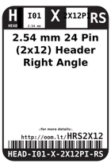
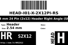
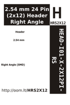

Contents
========

* [HRS2X12 > 2.54 mm 24 Pin (2x12) Header Right Angle (SMD)](#hrs2x12--254-mm-24-pin-2x12-header-right-angle-smd)
	* [Images](#images)
	* [Labels](#labels)
	* [EDA](#eda)
	* [Tags](#tags)

# HRS2X12 > 2.54 mm 24 Pin (2x12) Header Right Angle (SMD)

- ID: HEAD-I01-X-PI2X12-RS
- Hex ID: HRS2X12
- Name: 2.54 mm 24 Pin (2x12) Header Right Angle (SMD)
- Description: 2.54 mm 24 Pin (2x12) Header Right Angle (SMD)

## Images
  
  

|label-front|label-inventory|label-spec|
| :---: | :---: | :---: |
||||

## Labels
  
  

|label-front|label-inventory|label-spec|
| :---: | :---: | :---: |
||||

## EDA

### Symbols

## Tags

- oompSort: 
- oompType: HEAD
- oompSize: I01
- oompColor: X
- oompDesc: PI2X12
- oompIndex: RS
- oompVersion: 999
- hexID: HRS2X12
- ooPitch: 2.54 mm
- ooWidth: 30.48 mm
- ooHeight: 5.08 mm
- ooLength: 17.66 mm
- numPins: 24
- numRows: 2
- oompFootprint: HEAD-I01-X-PI2x12-RS
- oompID: HEAD-I01-X-PI2X12-RS
