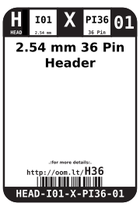
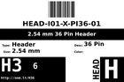
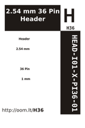
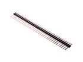
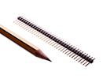

Contents
========

* [H36 > 2.54 mm 36 Pin Header](#h36--254-mm-36-pin-header)
	* [Datasheets](#datasheets)
	* [Labels](#labels)
	* [EDA](#eda)
	* [Images](#images)
	* [Tags](#tags)
  
![][im]
# H36 > 2.54 mm 36 Pin Header

- ID: HEAD-I01-X-PI36-01
- Hex ID: H36
- Name: 2.54 mm 36 Pin Header
- Description: 2.54 mm 36 Pin Header
- Long Link: [http://oom.lt/HEAD-I01-X-PI36-01](http://oom.lt/HEAD-I01-X-PI36-01)
- Short Link: [http://oom.lt/H36](http://oom.lt/H36)

## Datasheets

- Datasheet: [datasheet.pdf](datasheet.pdf)

## Labels
  
  

|label-front|label-inventory|label-spec|
| :---: | :---: | :---: |
||||

## EDA

### Footprints
  

|[  FOOTPRINT-kicad-kicad-footprints-Connector_PinHeader_2.54mm-PinHeader_1x36_P2.54mm_Vertical](https://github.com/oomlout/oomlout_OOMP_eda/tree/main/FOOTPRINT/kicad/kicad-footprints/Connector_PinHeader_2.54mm/PinHeader_1x36_P2.54mm_Vertical/)||||
| :---: | :---: | :---: | :---: |

### Symbols
  

|[  SYMBOL-kicad-kicad-symbols-Connector-Conn_01x36_Male](https://github.com/oomlout/oomlout_OOMP_eda/tree/main/SYMBOL/kicad/kicad-symbols/Connector/Conn_01x36_Male/)|[  SYMBOL-kicad-kicad-symbols-Connector_Generic-Conn_01x36](https://github.com/oomlout/oomlout_OOMP_eda/tree/main/SYMBOL/kicad/kicad-symbols/Connector_Generic/Conn_01x36/)|||
| :---: | :---: | :---: | :---: |

## Images
  
  

|image|image_RE|label-front|label-inventory|label-spec|
| :---: | :---: | :---: | :---: | :---: |
||||||

## Tags

- oompID: HEAD-I01-X-PI36-01
- name: 2.54 mm 36 Pin Header
- hexID: H36
- oompSort: 010136
- oompType: HEAD
- oompSize: I01
- oompColor: X
- oompDesc: PI36
- oompIndex: 01
- oompVersion: 10
- ooPitch: 2.54 mm
- ooWidth: 91.44mm
- ooHeight: 11.54 mm
- ooDepth: 2.54 mm
- ooNumPins: 36
- ooFootprint: OOMP-HEAD-I01-X-PI36-01
- ooMaxCurrent: 3 A
- ooMaxVoltage: 1000 V
- oompAbout: These 36 pin strips are by far the most common length. They are designed to be snapped to any length (using either pliers or snips) so are the most useful to have in your toolbox.
- oompClass: Through Hole Component
- oompClassCode: THTH
- oompBbls: variable;clear
- oompBbls: variable;pins;36
- oompBbls: template;XXXX-I01-X-XX-01-bbls
- oompDiag: variable;clear
- oompDiag: variable;pins;36
- oompDiag: template;HEAD-I01-X-XX-01-diag
- oompIden: variable;clear
- oompIden: variable;pins;36
- oompIden: template;XXXX-I01-X-XX-01-iden
- oompSchem: variable;clear
- oompSchem: variable;pins;36
- oompSchem: template;XXXX-XX-X-XX-01-PINS-EVEN-schem
- oompSimp: variable;clear
- oompSimp: variable;pins;36
- oompSimp: template;XXXX-I01-X-XX-01-simp
- ooDesignator: J1
- schematicSymbol: HEAD-XX-X-PI36-XX
- pcbFootprint: HEAD-I01-X-PI36-01
- footprintKicad: FOOTPRINT-kicad-kicad-footprints-Connector_PinHeader_2.54mm-PinHeader_1x36_P2.54mm_Vertical
- symbolKicad: SYMBOL-kicad-kicad-symbols-Connector-Conn_01x36_Male
- symbolKicad: SYMBOL-kicad-kicad-symbols-Connector_Generic-Conn_01x36

[im]: image_450.jpg
