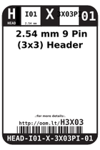
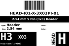
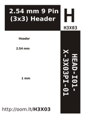

Contents
========

* [H3X03 >  2.54 mm 9 Pin (3x3) Header ](#h3x03---254-mm-9-pin-3x3-header-)
	* [Datasheets](#datasheets)
	* [Labels](#labels)
	* [EDA](#eda)
	* [Images](#images)
	* [Tags](#tags)

# H3X03 >  2.54 mm 9 Pin (3x3) Header 

- ID: HEAD-I01-X-PI3X03-01
- Hex ID: H3X03
- Name:  2.54 mm 9 Pin (3x3) Header 
- Description:  2.54 mm 9 Pin (3x3) Header 
- Long Link: [http://oom.lt/HEAD-I01-X-PI3X03-01](http://oom.lt/HEAD-I01-X-PI3X03-01)
- Short Link: [http://oom.lt/H3X03](http://oom.lt/H3X03)

## Datasheets

- Datasheet: [datasheet.pdf](datasheet.pdf)

## Labels
  
  

|label-front|label-inventory|label-spec|
| :---: | :---: | :---: |
||||

## EDA

### Symbols

## Images
  
  

|label-front|label-inventory|label-spec|
| :---: | :---: | :---: |
||||

## Tags

- oompID: HEAD-I01-X-PI3X03-01
- name:  2.54 mm 9 Pin (3x3) Header 
- hexID: H3X03
- oompSort: 
- oompType: HEAD
- oompSize: I01
- oompColor: X
- oompDesc: 3X03PI
- oompIndex: 01
- oompVersion: 98
- ooNumRows: 3
- ooNumPins: 3
- ooFootprint: OOMP-HEAD-I01-X-PI3X03-01
