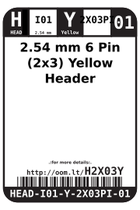
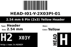
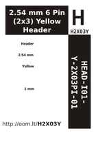
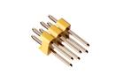

Contents
========

* [H2X03Y > 2.54 mm 6 Pin (2x3) Yellow Header](#h2x03y--254-mm-6-pin-2x3-yellow-header)
	* [Datasheets](#datasheets)
	* [Labels](#labels)
	* [EDA](#eda)
	* [Images](#images)
	* [Tags](#tags)
  
![][im]
# H2X03Y > 2.54 mm 6 Pin (2x3) Yellow Header

- ID: HEAD-I01-Y-2X03PI-01
- Hex ID: H2X03Y
- Name: 2.54 mm 6 Pin (2x3) Yellow Header
- Description: 2.54 mm 6 Pin (2x3) Yellow Header
- Long Link: [http://oom.lt/HEAD-I01-Y-2X03PI-01](http://oom.lt/HEAD-I01-Y-2X03PI-01)
- Short Link: [http://oom.lt/H2X03Y](http://oom.lt/H2X03Y)

## Datasheets

- Datasheet: [datasheet.pdf](datasheet.pdf)

## Labels
  
  

|label-front|label-inventory|label-spec|
| :---: | :---: | :---: |
||||

## EDA

## Images
  
  

|image|image_RE|label-front|label-inventory|label-spec|
| :---: | :---: | :---: | :---: | :---: |
||||||

## Tags

- oompID: HEAD-I01-Y-2X03PI-01
- name: 2.54 mm 6 Pin (2x3) Yellow Header
- hexID: H2X03Y
- oompSort: 
- oompClass: Through Hole
- oompClassCode: THTH
- oompType: HEAD
- oompSize: I01
- oompColor: Y
- oompDesc: 2X03PI
- oompIndex: 01
- oompVersion: 40
- ooPitch: 2.54
- ooPinHeight: 11.60
- ooPinWidth: 0.64
- ooPinOffset: 1.53
- ooNumRows: 2
- ooNumPins: 6
- ooFootprint: OOMP-HEAD-I01-X-2X03PI-01
- ooDesignator: J1

[im]: image_450.jpg
