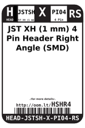
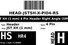
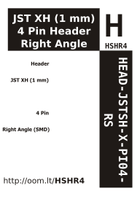

Contents
========

* [HSHR4 > ](#hshr4--)
	* [Datasheets](#datasheets)
	* [Labels](#labels)
	* [EDA](#eda)
	* [Images](#images)
	* [Tags](#tags)

# HSHR4 > 

- ID: HEAD-JSTSH-X-PI04-RS
- Hex ID: HSHR4
- Name: 
- Description: 
- Long Link: [http://oom.lt/HEAD-JSTSH-X-PI04-RS](http://oom.lt/HEAD-JSTSH-X-PI04-RS)
- Short Link: [http://oom.lt/HSHR4](http://oom.lt/HSHR4)

## Datasheets

- Datasheet: [datasheet.pdf](datasheet.pdf)

## Labels
  
  

|label-front|label-inventory|label-spec|
| :---: | :---: | :---: |
||||

## EDA

### Symbols
  

|[  SYMBOL-kicad-kicad-symbols-Connector-Conn_01x04_Male](https://github.com/oomlout/oomlout_OOMP_eda/tree/main/SYMBOL/kicad/kicad-symbols/Connector/Conn_01x04_Male/)|[  SYMBOL-kicad-kicad-symbols-Connector_Generic-Conn_01x04](https://github.com/oomlout/oomlout_OOMP_eda/tree/main/SYMBOL/kicad/kicad-symbols/Connector_Generic/Conn_01x04/)|||
| :---: | :---: | :---: | :---: |

## Images
  
  

|label-front|label-inventory|label-spec|
| :---: | :---: | :---: |
||||

## Tags

- oompType: HEAD
- oompSize: JSTSH
- oompColor: X
- oompDesc: PI04
- oompIndex: RS
- hexID: HSHR4
- oompID: HEAD-JSTSH-X-PI04-RS
- symbolKicad: SYMBOL-kicad-kicad-symbols-Connector-Conn_01x04_Male
- symbolKicad: SYMBOL-kicad-kicad-symbols-Connector_Generic-Conn_01x04
