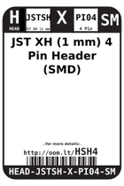
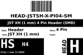
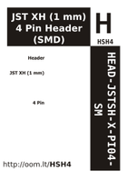

Contents
========

* [HSH4 > JST XH (1 mm) 4 Pin Header (SMD)](#hsh4--jst-xh-1-mm-4-pin-header-smd)
	* [Labels](#labels)
	* [EDA](#eda)
	* [Images](#images)
	* [Tags](#tags)

# HSH4 > JST XH (1 mm) 4 Pin Header (SMD)

- ID: HEAD-JSTSH-X-PI04-SM
- Hex ID: HSH4
- Name: JST XH (1 mm) 4 Pin Header (SMD)
- Description: JST XH (1 mm) 4 Pin Header (SMD)
- Long Link: [http://oom.lt/HEAD-JSTSH-X-PI04-SM](http://oom.lt/HEAD-JSTSH-X-PI04-SM)
- Short Link: [http://oom.lt/HSH4](http://oom.lt/HSH4)

## Labels
  
  

|label-front|label-inventory|label-spec|
| :---: | :---: | :---: |
||||

## EDA

## Images
  
  

|label-front|label-inventory|label-spec|
| :---: | :---: | :---: |
||||

## Tags

- oompType: HEAD
- oompSize: JSTSH
- oompColor: X
- oompDesc: PI04
- oompIndex: SM
- hexID: HSH4
- oompID: HEAD-JSTSH-X-PI04-SM
