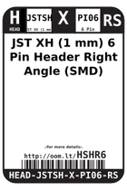
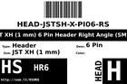
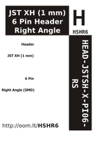

Contents
========

* [HSHR6 > JST XH (1 mm) 6 Pin Header Right Angle (SMD)](#hshr6--jst-xh-1-mm-6-pin-header-right-angle-smd)
	* [Labels](#labels)
	* [EDA](#eda)
	* [Images](#images)
	* [Tags](#tags)

# HSHR6 > JST XH (1 mm) 6 Pin Header Right Angle (SMD)

- ID: HEAD-JSTSH-X-PI06-RS
- Hex ID: HSHR6
- Name: JST XH (1 mm) 6 Pin Header Right Angle (SMD)
- Description: JST XH (1 mm) 6 Pin Header Right Angle (SMD)
- Long Link: [http://oom.lt/HEAD-JSTSH-X-PI06-RS](http://oom.lt/HEAD-JSTSH-X-PI06-RS)
- Short Link: [http://oom.lt/HSHR6](http://oom.lt/HSHR6)

## Labels
  
  

|label-front|label-inventory|label-spec|
| :---: | :---: | :---: |
||||

## EDA

### Symbols
  

|[  SYMBOL-kicad-kicad-symbols-Connector-Conn_01x06_Male](https://github.com/oomlout/oomlout_OOMP_eda/tree/main/SYMBOL/kicad/kicad-symbols/Connector/Conn_01x06_Male/)|[  SYMBOL-kicad-kicad-symbols-Connector_Generic-Conn_01x06](https://github.com/oomlout/oomlout_OOMP_eda/tree/main/SYMBOL/kicad/kicad-symbols/Connector_Generic/Conn_01x06/)|||
| :---: | :---: | :---: | :---: |

## Images
  
  

|label-front|label-inventory|label-spec|
| :---: | :---: | :---: |
||||

## Tags

- oompType: HEAD
- oompSize: JSTSH
- oompColor: X
- oompDesc: PI06
- oompIndex: RS
- hexID: HSHR6
- oompID: HEAD-JSTSH-X-PI06-RS
- symbolKicad: SYMBOL-kicad-kicad-symbols-Connector-Conn_01x06_Male
- symbolKicad: SYMBOL-kicad-kicad-symbols-Connector_Generic-Conn_01x06
