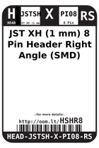
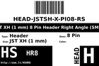
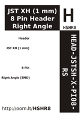

Contents
========

* [HSHR8 > JST XH (1 mm) 8 Pin Header Right Angle (SMD)](#hshr8--jst-xh-1-mm-8-pin-header-right-angle-smd)
	* [Labels](#labels)
	* [EDA](#eda)
	* [Images](#images)
	* [Tags](#tags)

# HSHR8 > JST XH (1 mm) 8 Pin Header Right Angle (SMD)

- ID: HEAD-JSTSH-X-PI08-RS
- Hex ID: HSHR8
- Name: JST XH (1 mm) 8 Pin Header Right Angle (SMD)
- Description: JST XH (1 mm) 8 Pin Header Right Angle (SMD)
- Long Link: [http://oom.lt/HEAD-JSTSH-X-PI08-RS](http://oom.lt/HEAD-JSTSH-X-PI08-RS)
- Short Link: [http://oom.lt/HSHR8](http://oom.lt/HSHR8)

## Labels
  
  

|label-front|label-inventory|label-spec|
| :---: | :---: | :---: |
||||

## EDA

## Images
  
  

|label-front|label-inventory|label-spec|
| :---: | :---: | :---: |
||||

## Tags

- oompType: HEAD
- oompSize: JSTSH
- oompColor: X
- oompDesc: PI08
- oompIndex: RS
- hexID: HSHR8
- oompID: HEAD-JSTSH-X-PI08-RS
