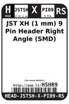
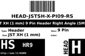
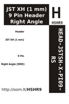

Contents
========

* [HSHR9 > JST XH (1 mm) 9 Pin Header Right Angle (SMD)](#hshr9--jst-xh-1-mm-9-pin-header-right-angle-smd)
	* [Labels](#labels)
	* [EDA](#eda)
	* [Images](#images)
	* [Tags](#tags)

# HSHR9 > JST XH (1 mm) 9 Pin Header Right Angle (SMD)

- ID: HEAD-JSTSH-X-PI09-RS
- Hex ID: HSHR9
- Name: JST XH (1 mm) 9 Pin Header Right Angle (SMD)
- Description: JST XH (1 mm) 9 Pin Header Right Angle (SMD)
- Long Link: [http://oom.lt/HEAD-JSTSH-X-PI09-RS](http://oom.lt/HEAD-JSTSH-X-PI09-RS)
- Short Link: [http://oom.lt/HSHR9](http://oom.lt/HSHR9)

## Labels
  
  

|label-front|label-inventory|label-spec|
| :---: | :---: | :---: |
||||

## EDA

### Symbols
  

|[  SYMBOL-kicad-kicad-symbols-Connector-Conn_01x09_Male](https://github.com/oomlout/oomlout_OOMP_eda/tree/main/SYMBOL/kicad/kicad-symbols/Connector/Conn_01x09_Male/)|[  SYMBOL-kicad-kicad-symbols-Connector_Generic-Conn_01x09](https://github.com/oomlout/oomlout_OOMP_eda/tree/main/SYMBOL/kicad/kicad-symbols/Connector_Generic/Conn_01x09/)|||
| :---: | :---: | :---: | :---: |

## Images
  
  

|label-front|label-inventory|label-spec|
| :---: | :---: | :---: |
||||

## Tags

- oompType: HEAD
- oompSize: JSTSH
- oompColor: X
- oompDesc: PI09
- oompIndex: RS
- hexID: HSHR9
- oompID: HEAD-JSTSH-X-PI09-RS
- symbolKicad: SYMBOL-kicad-kicad-symbols-Connector-Conn_01x09_Male
- symbolKicad: SYMBOL-kicad-kicad-symbols-Connector_Generic-Conn_01x09
