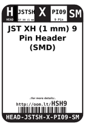
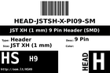
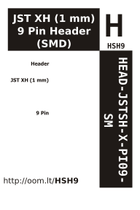

Contents
========

* [HSH9 > JST XH (1 mm) 9 Pin Header (SMD)](#hsh9--jst-xh-1-mm-9-pin-header-smd)
	* [Labels](#labels)
	* [EDA](#eda)
	* [Images](#images)
	* [Tags](#tags)

# HSH9 > JST XH (1 mm) 9 Pin Header (SMD)

- ID: HEAD-JSTSH-X-PI09-SM
- Hex ID: HSH9
- Name: JST XH (1 mm) 9 Pin Header (SMD)
- Description: JST XH (1 mm) 9 Pin Header (SMD)
- Long Link: [http://oom.lt/HEAD-JSTSH-X-PI09-SM](http://oom.lt/HEAD-JSTSH-X-PI09-SM)
- Short Link: [http://oom.lt/HSH9](http://oom.lt/HSH9)

## Labels
  
  

|label-front|label-inventory|label-spec|
| :---: | :---: | :---: |
||||

## EDA

## Images
  
  

|label-front|label-inventory|label-spec|
| :---: | :---: | :---: |
||||

## Tags

- oompType: HEAD
- oompSize: JSTSH
- oompColor: X
- oompDesc: PI09
- oompIndex: SM
- hexID: HSH9
- oompID: HEAD-JSTSH-X-PI09-SM
