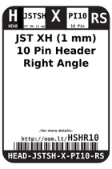
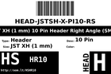
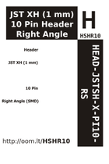

Contents
========

* [HSHR10 > JST XH (1 mm) 10 Pin Header Right Angle (SMD)](#hshr10--jst-xh-1-mm-10-pin-header-right-angle-smd)
	* [Labels](#labels)
	* [EDA](#eda)
	* [Images](#images)
	* [Tags](#tags)

# HSHR10 > JST XH (1 mm) 10 Pin Header Right Angle (SMD)

- ID: HEAD-JSTSH-X-PI10-RS
- Hex ID: HSHR10
- Name: JST XH (1 mm) 10 Pin Header Right Angle (SMD)
- Description: JST XH (1 mm) 10 Pin Header Right Angle (SMD)
- Long Link: [http://oom.lt/HEAD-JSTSH-X-PI10-RS](http://oom.lt/HEAD-JSTSH-X-PI10-RS)
- Short Link: [http://oom.lt/HSHR10](http://oom.lt/HSHR10)

## Labels
  
  

|label-front|label-inventory|label-spec|
| :---: | :---: | :---: |
||||

## EDA

### Symbols
  

|[  SYMBOL-kicad-kicad-symbols-Connector-Conn_01x10_Male](https://github.com/oomlout/oomlout_OOMP_eda/tree/main/SYMBOL/kicad/kicad-symbols/Connector/Conn_01x10_Male/)|[  SYMBOL-kicad-kicad-symbols-Connector_Generic-Conn_01x10](https://github.com/oomlout/oomlout_OOMP_eda/tree/main/SYMBOL/kicad/kicad-symbols/Connector_Generic/Conn_01x10/)|||
| :---: | :---: | :---: | :---: |

## Images
  
  

|label-front|label-inventory|label-spec|
| :---: | :---: | :---: |
||||

## Tags

- oompType: HEAD
- oompSize: JSTSH
- oompColor: X
- oompDesc: PI10
- oompIndex: RS
- hexID: HSHR10
- oompID: HEAD-JSTSH-X-PI10-RS
- symbolKicad: SYMBOL-kicad-kicad-symbols-Connector-Conn_01x10_Male
- symbolKicad: SYMBOL-kicad-kicad-symbols-Connector_Generic-Conn_01x10
