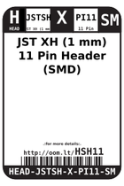
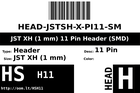
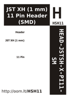

Contents
========

* [HSH11 > JST XH (1 mm) 11 Pin Header (SMD)](#hsh11--jst-xh-1-mm-11-pin-header-smd)
	* [Labels](#labels)
	* [EDA](#eda)
	* [Images](#images)
	* [Tags](#tags)

# HSH11 > JST XH (1 mm) 11 Pin Header (SMD)

- ID: HEAD-JSTSH-X-PI11-SM
- Hex ID: HSH11
- Name: JST XH (1 mm) 11 Pin Header (SMD)
- Description: JST XH (1 mm) 11 Pin Header (SMD)
- Long Link: [http://oom.lt/HEAD-JSTSH-X-PI11-SM](http://oom.lt/HEAD-JSTSH-X-PI11-SM)
- Short Link: [http://oom.lt/HSH11](http://oom.lt/HSH11)

## Labels
  
  

|label-front|label-inventory|label-spec|
| :---: | :---: | :---: |
||||

## EDA

### Footprints
  

|[  FOOTPRINT-kicad-kicad-footprints-Connector_JST-JST_SH_BM11B-SRSS-TB_1x11-1MP_P1.00mm_Vertical](https://github.com/oomlout/oomlout_OOMP_eda/tree/main/FOOTPRINT/kicad/kicad-footprints/Connector_JST/JST_SH_BM11B-SRSS-TB_1x11-1MP_P1.00mm_Vertical/)||||
| :---: | :---: | :---: | :---: |

### Symbols
  

|[  SYMBOL-kicad-kicad-symbols-Connector-Conn_01x11_Male](https://github.com/oomlout/oomlout_OOMP_eda/tree/main/SYMBOL/kicad/kicad-symbols/Connector/Conn_01x11_Male/)|[  SYMBOL-kicad-kicad-symbols-Connector_Generic-Conn_01x11](https://github.com/oomlout/oomlout_OOMP_eda/tree/main/SYMBOL/kicad/kicad-symbols/Connector_Generic/Conn_01x11/)|||
| :---: | :---: | :---: | :---: |

## Images
  
  

|label-front|label-inventory|label-spec|
| :---: | :---: | :---: |
||||

## Tags

- oompType: HEAD
- oompSize: JSTSH
- oompColor: X
- oompDesc: PI11
- oompIndex: SM
- hexID: HSH11
- oompID: HEAD-JSTSH-X-PI11-SM
- symbolKicad: SYMBOL-kicad-kicad-symbols-Connector-Conn_01x11_Male
- symbolKicad: SYMBOL-kicad-kicad-symbols-Connector_Generic-Conn_01x11
- footprintKicad: FOOTPRINT-kicad-kicad-footprints-Connector_JST-JST_SH_BM11B-SRSS-TB_1x11-1MP_P1.00mm_Vertical
