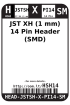
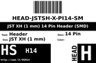
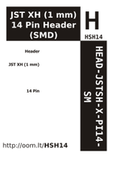

Contents
========

* [HSH14 > ](#hsh14--)
	* [Labels](#labels)
	* [EDA](#eda)
	* [Images](#images)
	* [Tags](#tags)

# HSH14 > 

- ID: HEAD-JSTSH-X-PI14-SM
- Hex ID: HSH14
- Name: 
- Description: 
- Long Link: [http://oom.lt/HEAD-JSTSH-X-PI14-SM](http://oom.lt/HEAD-JSTSH-X-PI14-SM)
- Short Link: [http://oom.lt/HSH14](http://oom.lt/HSH14)

## Labels
  
  

|label-front|label-inventory|label-spec|
| :---: | :---: | :---: |
||||

## EDA

### Footprints
  

|[  FOOTPRINT-kicad-kicad-footprints-Connector_JST-JST_SH_BM14B-SRSS-TB_1x14-1MP_P1.00mm_Vertical](https://github.com/oomlout/oomlout_OOMP_eda/tree/main/FOOTPRINT/kicad/kicad-footprints/Connector_JST/JST_SH_BM14B-SRSS-TB_1x14-1MP_P1.00mm_Vertical/)||||
| :---: | :---: | :---: | :---: |

### Symbols
  

|[  SYMBOL-kicad-kicad-symbols-Connector-Conn_01x14_Male](https://github.com/oomlout/oomlout_OOMP_eda/tree/main/SYMBOL/kicad/kicad-symbols/Connector/Conn_01x14_Male/)|[  SYMBOL-kicad-kicad-symbols-Connector_Generic-Conn_01x14](https://github.com/oomlout/oomlout_OOMP_eda/tree/main/SYMBOL/kicad/kicad-symbols/Connector_Generic/Conn_01x14/)|||
| :---: | :---: | :---: | :---: |

## Images
  
  

|label-front|label-inventory|label-spec|
| :---: | :---: | :---: |
||||

## Tags

- oompType: HEAD
- oompSize: JSTSH
- oompColor: X
- oompDesc: PI14
- oompIndex: SM
- hexID: HSH14
- oompID: HEAD-JSTSH-X-PI14-SM
- footprintKicad: FOOTPRINT-kicad-kicad-footprints-Connector_JST-JST_SH_BM14B-SRSS-TB_1x14-1MP_P1.00mm_Vertical
- symbolKicad: SYMBOL-kicad-kicad-symbols-Connector-Conn_01x14_Male
- symbolKicad: SYMBOL-kicad-kicad-symbols-Connector_Generic-Conn_01x14
