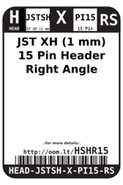
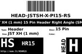
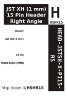

Contents
========

* [HSHR15 > ](#hshr15--)
	* [Labels](#labels)
	* [EDA](#eda)
	* [Images](#images)
	* [Tags](#tags)

# HSHR15 > 

- ID: HEAD-JSTSH-X-PI15-RS
- Hex ID: HSHR15
- Name: 
- Description: 
- Long Link: [http://oom.lt/HEAD-JSTSH-X-PI15-RS](http://oom.lt/HEAD-JSTSH-X-PI15-RS)
- Short Link: [http://oom.lt/HSHR15](http://oom.lt/HSHR15)

## Labels
  
  

|label-front|label-inventory|label-spec|
| :---: | :---: | :---: |
||||

## EDA

### Symbols
  

|[  SYMBOL-kicad-kicad-symbols-Connector-Conn_01x15_Male](https://github.com/oomlout/oomlout_OOMP_eda/tree/main/SYMBOL/kicad/kicad-symbols/Connector/Conn_01x15_Male/)|[  SYMBOL-kicad-kicad-symbols-Connector_Generic-Conn_01x15](https://github.com/oomlout/oomlout_OOMP_eda/tree/main/SYMBOL/kicad/kicad-symbols/Connector_Generic/Conn_01x15/)|||
| :---: | :---: | :---: | :---: |

## Images
  
  

|label-front|label-inventory|label-spec|
| :---: | :---: | :---: |
||||

## Tags

- oompType: HEAD
- oompSize: JSTSH
- oompColor: X
- oompDesc: PI15
- oompIndex: RS
- hexID: HSHR15
- oompID: HEAD-JSTSH-X-PI15-RS
- symbolKicad: SYMBOL-kicad-kicad-symbols-Connector-Conn_01x15_Male
- symbolKicad: SYMBOL-kicad-kicad-symbols-Connector_Generic-Conn_01x15
