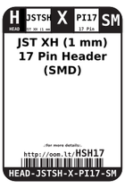
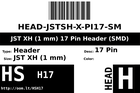
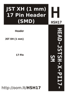

Contents
========

* [HSH17 > JST XH (1 mm) 17 Pin Header (SMD)](#hsh17--jst-xh-1-mm-17-pin-header-smd)
	* [Labels](#labels)
	* [EDA](#eda)
	* [Images](#images)
	* [Tags](#tags)

# HSH17 > JST XH (1 mm) 17 Pin Header (SMD)

- ID: HEAD-JSTSH-X-PI17-SM
- Hex ID: HSH17
- Name: JST XH (1 mm) 17 Pin Header (SMD)
- Description: JST XH (1 mm) 17 Pin Header (SMD)
- Long Link: [http://oom.lt/HEAD-JSTSH-X-PI17-SM](http://oom.lt/HEAD-JSTSH-X-PI17-SM)
- Short Link: [http://oom.lt/HSH17](http://oom.lt/HSH17)

## Labels
  
  

|label-front|label-inventory|label-spec|
| :---: | :---: | :---: |
||||

## EDA

### Footprints
  

|[  ----](https://github.com/oomlout/oomlout_OOMP_parts/tree/main/----/)||||
| :---: | :---: | :---: | :---: |

### Symbols
  

|[  SYMBOL-kicad-kicad-symbols-Connector-Conn_01x17_Male](https://github.com/oomlout/oomlout_OOMP_eda/tree/main/SYMBOL/kicad/kicad-symbols/Connector/Conn_01x17_Male/)|[  SYMBOL-kicad-kicad-symbols-Connector_Generic-Conn_01x17](https://github.com/oomlout/oomlout_OOMP_eda/tree/main/SYMBOL/kicad/kicad-symbols/Connector_Generic/Conn_01x17/)|||
| :---: | :---: | :---: | :---: |

## Images
  
  

|label-front|label-inventory|label-spec|
| :---: | :---: | :---: |
||||

## Tags

- oompType: HEAD
- oompSize: JSTSH
- oompColor: X
- oompDesc: PI17
- oompIndex: SM
- hexID: HSH17
- oompID: HEAD-JSTSH-X-PI17-SM
- symbolKicad: SYMBOL-kicad-kicad-symbols-Connector-Conn_01x17_Male
- symbolKicad: SYMBOL-kicad-kicad-symbols-Connector_Generic-Conn_01x17
- footprintKicad: FOOTPRINT-kicad-kicad-footprints-Connector_JST-JST_SH_BM17B-SRSS-TB_1x17-1MP_P1.00mm_Vertical
