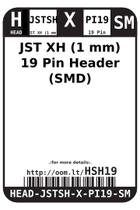
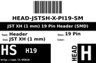
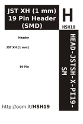

Contents
========

* [HSH19 > JST XH (1 mm) 19 Pin Header (SMD)](#hsh19--jst-xh-1-mm-19-pin-header-smd)
	* [Labels](#labels)
	* [EDA](#eda)
	* [Images](#images)
	* [Tags](#tags)

# HSH19 > JST XH (1 mm) 19 Pin Header (SMD)

- ID: HEAD-JSTSH-X-PI19-SM
- Hex ID: HSH19
- Name: JST XH (1 mm) 19 Pin Header (SMD)
- Description: JST XH (1 mm) 19 Pin Header (SMD)
- Long Link: [http://oom.lt/HEAD-JSTSH-X-PI19-SM](http://oom.lt/HEAD-JSTSH-X-PI19-SM)
- Short Link: [http://oom.lt/HSH19](http://oom.lt/HSH19)

## Labels
  
  

|label-front|label-inventory|label-spec|
| :---: | :---: | :---: |
||||

## EDA

### Footprints
  

|[  ----](https://github.com/oomlout/oomlout_OOMP_parts/tree/main/----/)||||
| :---: | :---: | :---: | :---: |

### Symbols
  

|[  SYMBOL-kicad-kicad-symbols-Connector-Conn_01x19_Male](https://github.com/oomlout/oomlout_OOMP_eda/tree/main/SYMBOL/kicad/kicad-symbols/Connector/Conn_01x19_Male/)|[  SYMBOL-kicad-kicad-symbols-Connector_Generic-Conn_01x19](https://github.com/oomlout/oomlout_OOMP_eda/tree/main/SYMBOL/kicad/kicad-symbols/Connector_Generic/Conn_01x19/)|||
| :---: | :---: | :---: | :---: |

## Images
  
  

|label-front|label-inventory|label-spec|
| :---: | :---: | :---: |
||||

## Tags

- oompType: HEAD
- oompSize: JSTSH
- oompColor: X
- oompDesc: PI19
- oompIndex: SM
- hexID: HSH19
- oompID: HEAD-JSTSH-X-PI19-SM
- footprintKicad: FOOTPRINT-kicad-kicad-footprints-Connector_JST-JST_SH_BM19B-SRSS-TB_1x19-1MP_P1.00mm_Vertical
- symbolKicad: SYMBOL-kicad-kicad-symbols-Connector-Conn_01x19_Male
- symbolKicad: SYMBOL-kicad-kicad-symbols-Connector_Generic-Conn_01x19
