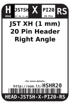
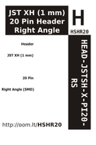

Contents
========

* [HSHR20 > JST XH (1 mm) 20 Pin Header Right Angle (SMD)](#hshr20--jst-xh-1-mm-20-pin-header-right-angle-smd)
	* [Labels](#labels)
	* [EDA](#eda)
	* [Images](#images)
	* [Tags](#tags)

# HSHR20 > JST XH (1 mm) 20 Pin Header Right Angle (SMD)

- ID: HEAD-JSTSH-X-PI20-RS
- Hex ID: HSHR20
- Name: JST XH (1 mm) 20 Pin Header Right Angle (SMD)
- Description: JST XH (1 mm) 20 Pin Header Right Angle (SMD)
- Long Link: [http://oom.lt/HEAD-JSTSH-X-PI20-RS](http://oom.lt/HEAD-JSTSH-X-PI20-RS)
- Short Link: [http://oom.lt/HSHR20](http://oom.lt/HSHR20)

## Labels
  
  

|label-front|label-inventory|label-spec|
| :---: | :---: | :---: |
||||

## EDA

## Images
  
  

|label-front|label-inventory|label-spec|
| :---: | :---: | :---: |
||||

## Tags

- oompType: HEAD
- oompSize: JSTSH
- oompColor: X
- oompDesc: PI20
- oompIndex: RS
- hexID: HSHR20
- oompID: HEAD-JSTSH-X-PI20-RS
