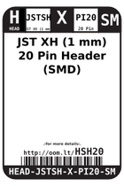
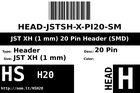
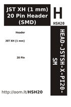

Contents
========

* [HSH20 > ](#hsh20--)
	* [Labels](#labels)
	* [EDA](#eda)
	* [Images](#images)
	* [Tags](#tags)

# HSH20 > 

- ID: HEAD-JSTSH-X-PI20-SM
- Hex ID: HSH20
- Name: 
- Description: 
- Long Link: [http://oom.lt/HEAD-JSTSH-X-PI20-SM](http://oom.lt/HEAD-JSTSH-X-PI20-SM)
- Short Link: [http://oom.lt/HSH20](http://oom.lt/HSH20)

## Labels
  
  

|label-front|label-inventory|label-spec|
| :---: | :---: | :---: |
||||

## EDA

### Footprints
  

|[  ----](https://github.com/oomlout/oomlout_OOMP_parts/tree/main/----/)||||
| :---: | :---: | :---: | :---: |

### Symbols
  

|[  SYMBOL-kicad-kicad-symbols-Connector-Conn_01x20_Male](https://github.com/oomlout/oomlout_OOMP_eda/tree/main/SYMBOL/kicad/kicad-symbols/Connector/Conn_01x20_Male/)|[  SYMBOL-kicad-kicad-symbols-Connector_Generic-Conn_01x20](https://github.com/oomlout/oomlout_OOMP_eda/tree/main/SYMBOL/kicad/kicad-symbols/Connector_Generic/Conn_01x20/)|||
| :---: | :---: | :---: | :---: |

## Images
  
  

|label-front|label-inventory|label-spec|
| :---: | :---: | :---: |
||||

## Tags

- oompType: HEAD
- oompSize: JSTSH
- oompColor: X
- oompDesc: PI20
- oompIndex: SM
- hexID: HSH20
- oompID: HEAD-JSTSH-X-PI20-SM
- footprintKicad: FOOTPRINT-kicad-kicad-footprints-Connector_JST-JST_SH_BM20B-SRSS-TB_1x20-1MP_P1.00mm_Vertical
- symbolKicad: SYMBOL-kicad-kicad-symbols-Connector-Conn_01x20_Male
- symbolKicad: SYMBOL-kicad-kicad-symbols-Connector_Generic-Conn_01x20
