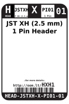
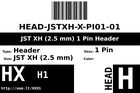
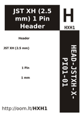

Contents
========

* [HXH1 > ](#hxh1--)
	* [Labels](#labels)
	* [EDA](#eda)
	* [Images](#images)
	* [Tags](#tags)

# HXH1 > 

- ID: HEAD-JSTXH-X-PI01-01
- Hex ID: HXH1
- Name: 
- Description: 
- Long Link: [http://oom.lt/HEAD-JSTXH-X-PI01-01](http://oom.lt/HEAD-JSTXH-X-PI01-01)
- Short Link: [http://oom.lt/HXH1](http://oom.lt/HXH1)

## Labels
  
  

|label-front|label-inventory|label-spec|
| :---: | :---: | :---: |
||||

## EDA

### Footprints
  

|[  FOOTPRINT-kicad-kicad-footprints-Connector_JST-JST_XH_B1B-XH-AM_1x01_P2.50mm_Vertical](https://github.com/oomlout/oomlout_OOMP_eda/tree/main/FOOTPRINT/kicad/kicad-footprints/Connector_JST/JST_XH_B1B-XH-AM_1x01_P2.50mm_Vertical/)|[  ----](https://github.com/oomlout/oomlout_OOMP_parts/tree/main/----/)|||
| :---: | :---: | :---: | :---: |

### Symbols
  

|[  SYMBOL-kicad-kicad-symbols-Connector-Conn_01x01_Male](https://github.com/oomlout/oomlout_OOMP_eda/tree/main/SYMBOL/kicad/kicad-symbols/Connector/Conn_01x01_Male/)|[  SYMBOL-kicad-kicad-symbols-Connector_Generic-Conn_01x01](https://github.com/oomlout/oomlout_OOMP_eda/tree/main/SYMBOL/kicad/kicad-symbols/Connector_Generic/Conn_01x01/)|||
| :---: | :---: | :---: | :---: |

## Images
  
  

|label-front|label-inventory|label-spec|
| :---: | :---: | :---: |
||||

## Tags

- oompType: HEAD
- oompSize: JSTXH
- oompColor: X
- oompDesc: PI01
- oompIndex: 01
- hexID: HXH1
- oompID: HEAD-JSTXH-X-PI01-01
- footprintKicad: FOOTPRINT-kicad-kicad-footprints-Connector_JST-JST_XH_B1B-XH-AM_1x01_P2.50mm_Vertical
- footprintKicad: FOOTPRINT-kicad-kicad-footprints-Connector_JST-JST_XH_B1B-XH-A_1x01_P2.50mm_Vertical
- symbolKicad: SYMBOL-kicad-kicad-symbols-Connector-Conn_01x01_Male
- symbolKicad: SYMBOL-kicad-kicad-symbols-Connector_Generic-Conn_01x01
