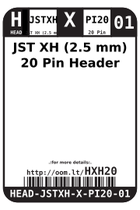
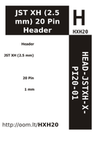

Contents
========

* [HXH20 > JST XH (2.5 mm) 20 Pin Header](#hxh20--jst-xh-25-mm-20-pin-header)
	* [Labels](#labels)
	* [EDA](#eda)
	* [Images](#images)
	* [Tags](#tags)

# HXH20 > JST XH (2.5 mm) 20 Pin Header

- ID: HEAD-JSTXH-X-PI20-01
- Hex ID: HXH20
- Name: JST XH (2.5 mm) 20 Pin Header
- Description: JST XH (2.5 mm) 20 Pin Header
- Long Link: [http://oom.lt/HEAD-JSTXH-X-PI20-01](http://oom.lt/HEAD-JSTXH-X-PI20-01)
- Short Link: [http://oom.lt/HXH20](http://oom.lt/HXH20)

## Labels
  
  

|label-front|label-inventory|label-spec|
| :---: | :---: | :---: |
||||

## EDA

### Footprints
  

|[  ----](https://github.com/oomlout/oomlout_OOMP_parts/tree/main/----/)|[  FOOTPRINT-kicad-kicad-footprints-Connector_JST-JST_XH_B20B-XH-A_1x20_P2.50mm_Vertical](https://github.com/oomlout/oomlout_OOMP_eda/tree/main/FOOTPRINT/kicad/kicad-footprints/Connector_JST/JST_XH_B20B-XH-A_1x20_P2.50mm_Vertical/)|||
| :---: | :---: | :---: | :---: |

### Symbols
  

|[  SYMBOL-kicad-kicad-symbols-Connector-Conn_01x20_Male](https://github.com/oomlout/oomlout_OOMP_eda/tree/main/SYMBOL/kicad/kicad-symbols/Connector/Conn_01x20_Male/)|[  SYMBOL-kicad-kicad-symbols-Connector_Generic-Conn_01x20](https://github.com/oomlout/oomlout_OOMP_eda/tree/main/SYMBOL/kicad/kicad-symbols/Connector_Generic/Conn_01x20/)|||
| :---: | :---: | :---: | :---: |

## Images
  
  

|label-front|label-inventory|label-spec|
| :---: | :---: | :---: |
||||

## Tags

- oompType: HEAD
- oompSize: JSTXH
- oompColor: X
- oompDesc: PI20
- oompIndex: 01
- hexID: HXH20
- oompID: HEAD-JSTXH-X-PI20-01
- symbolKicad: SYMBOL-kicad-kicad-symbols-Connector-Conn_01x20_Male
- symbolKicad: SYMBOL-kicad-kicad-symbols-Connector_Generic-Conn_01x20
- footprintKicad: FOOTPRINT-kicad-kicad-footprints-Connector_JST-JST_XH_B20B-XH-AM_1x20_P2.50mm_Vertical
- footprintKicad: FOOTPRINT-kicad-kicad-footprints-Connector_JST-JST_XH_B20B-XH-A_1x20_P2.50mm_Vertical
