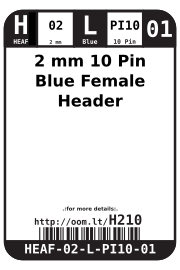
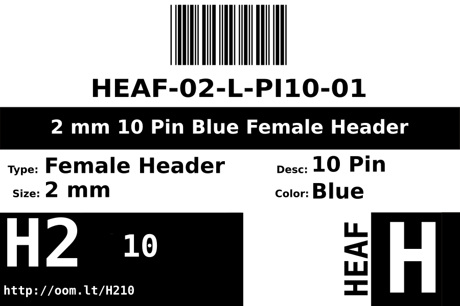
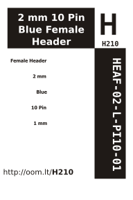

Contents
========

* [HEAF-02-L-PI10-01>2 mm 10 Pin Blue Female Header](#heaf-02-l-pi10-012-mm-10-pin-blue-female-header)
	* [Images](#images)
	* [Datasheets](#datasheets)
	* [Labels](#labels)
	* [EDA](#eda)
		* [Symbols](#symbols)
	* [Tags](#tags)
  
![][im]
# HEAF-02-L-PI10-01>2 mm 10 Pin Blue Female Header

- ID: HEAF-02-L-PI10-01
- Name: HEAF-02-L-PI10-01

## Images
  
  

|Main|
| :---: |
||

## Datasheets

- Datasheet: [datasheet.pdf](datasheet.pdf)

## Labels
  
  

|Front|Inventory|Specifications|
| :---: | :---: | :---: |
||||

## EDA

### Symbols

## Tags

- index: 12529
- oompID: HEAF-02-L-PI10-01
- name: 2 mm 10 Pin Blue Female Header
- hexID: H210
- oompSort: 
- oompClass: Through Hole
- oompClassCode: THTH
- oompType: HEAF
- oompSize: 02
- oompColor: L
- oompDesc: PI10
- oompIndex: 01
- oompVersion: 40
- ooNumPins: 10
- ooFootprint: OOMP-HEAD-02-X-PI10-01
- ooDesignator: J1

[im]: image_600.jpg
