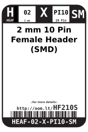

Contents
========

* [HEAF-02-X-PI10-SM>2 mm 10 Pin Female Header (SMD)](#heaf-02-x-pi10-sm2-mm-10-pin-female-header-smd)
	* [Datasheets](#datasheets)
	* [Labels](#labels)
	* [EDA](#eda)
		* [Symbols](#symbols)
	* [Tags](#tags)

# HEAF-02-X-PI10-SM>2 mm 10 Pin Female Header (SMD)

- ID: HEAF-02-X-PI10-SM
- Name: HEAF-02-X-PI10-SM

## Datasheets

- Datasheet: [datasheet.pdf](datasheet.pdf)

## Labels
  
  

|Front|Inventory|Specifications|
| :---: | :---: | :---: |
||||

## EDA

### Symbols

## Tags

- index: 12532
- oompID: HEAF-02-X-PI10-SM
- name: 2 mm 10 Pin Female Header (SMD)
- hexID: HF210S
- oompSort: HEAF0210PI
- oompType: HEAF
- oompSize: 02
- oompColor: X
- oompDesc: PI10
- oompIndex: SM
- oompVersion: 98
- ooNumPins: 10
- ooFootprint: OOMP-HEAD-I01-X-PI10-SM
- ooDesignator: J1
