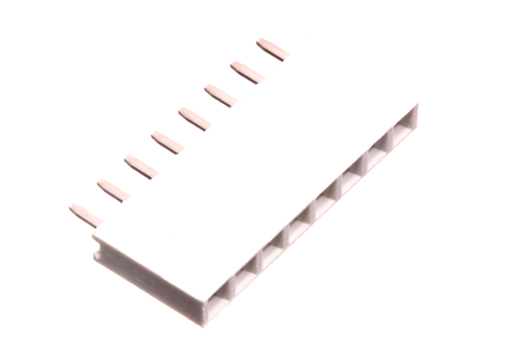
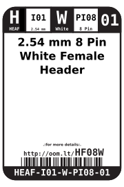
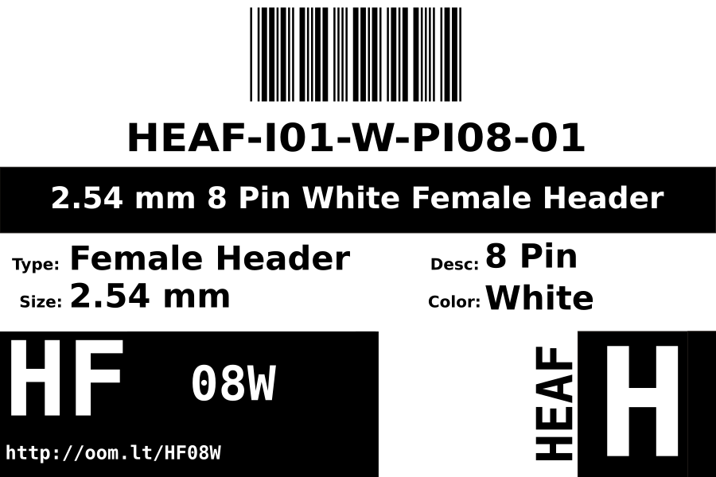
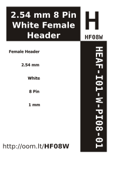

Contents
========

* [HEAF-I01-W-PI08-01>2.54 mm 8 Pin White Female Header](#heaf-i01-w-pi08-01254-mm-8-pin-white-female-header)
	* [Images](#images)
	* [Datasheets](#datasheets)
	* [Labels](#labels)
	* [EDA](#eda)
		* [Symbols](#symbols)
	* [Tags](#tags)
  
![][im]
# HEAF-I01-W-PI08-01>2.54 mm 8 Pin White Female Header

- ID: HEAF-I01-W-PI08-01
- Name: HEAF-I01-W-PI08-01

## Images
  
  

|Main|
| :---: |
||

## Datasheets

- Datasheet: [datasheet.pdf](datasheet.pdf)

## Labels
  
  

|Front|Inventory|Specifications|
| :---: | :---: | :---: |
||||

## EDA

### Symbols

## Tags

- index: 12534
- oompID: HEAF-I01-W-PI08-01
- name: 2.54 mm 8 Pin White Female Header
- hexID: HF08W
- oompSort: 
- oompClass: Through Hole
- oompClassCode: THTH
- oompType: HEAF
- oompSize: I01
- oompColor: W
- oompDesc: PI08
- oompIndex: 01
- oompVersion: 40
- ooNumPins: 8
- ooFootprint: OOMP-HEAD-I01-X-PI08-01
- oompBbls: variable;clear
- oompBbls: variable;pins;8
- oompBbls: template;XXXX-I01-X-XX-01-bbls
- oompDiag: variable;clear
- oompDiag: variable;pins;8
- oompDiag: template;HEAF-I01-X-XX-01-diag
- drawItem: variable;clear
- drawItem: variable;pins;8
- drawItem: template;XXXX-I01-X-XX-01-iden
- oompSchem: variable;clear
- oompSchem: variable;pins;8
- oompSchem: template;XXXX-XX-X-XX-01-PINS-EVEN-schem
- oompSimp: variable;clear
- oompSimp: variable;pins;8
- oompSimp: template;XXXX-I01-X-XX-01-simp
- ooDesignator: J1

[im]: image_600.jpg
