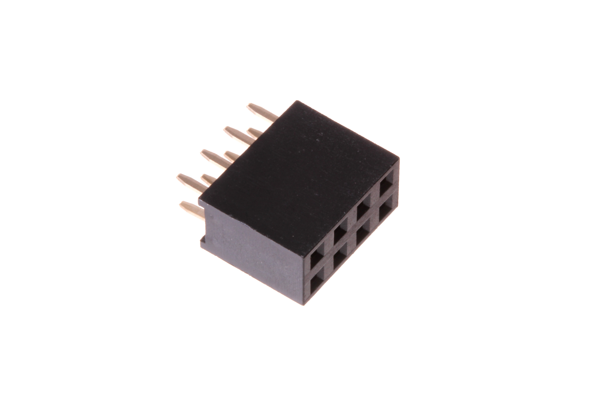
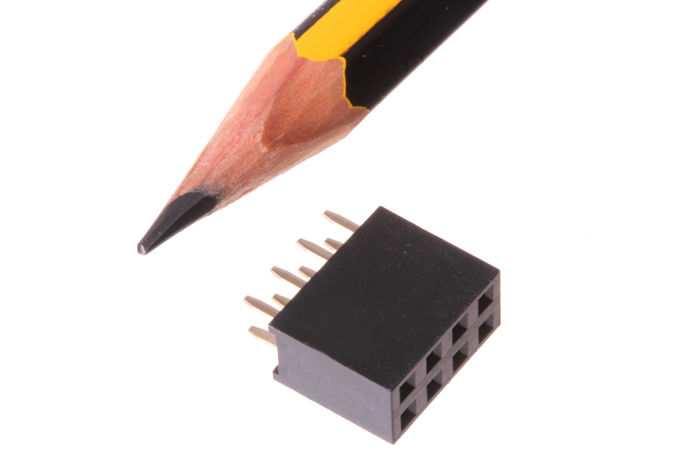

Contents
========

* [HEAF-I01-X-2X04PI-01>2.54 mm 8 Pin (2x4) Female Header](#heaf-i01-x-2x04pi-01254-mm-8-pin-2x4-female-header)
	* [Images](#images)
	* [Datasheets](#datasheets)
	* [EDA](#eda)
		* [Footprints](#footprints)
		* [Symbols](#symbols)
	* [Tags](#tags)
  
![][im]
# HEAF-I01-X-2X04PI-01>2.54 mm 8 Pin (2x4) Female Header

- ID: HEAF-I01-X-2X04PI-01
- Name: HEAF-I01-X-2X04PI-01

## Images
  
  

|Main|Reference|
| :---: | :---: |
|||

## Datasheets

- Datasheet: [datasheet.pdf](datasheet.pdf)

## EDA

### Footprints
  

|||||
| :---: | :---: | :---: | :---: |

### Symbols

## Tags

- index: 236
- oompID: HEAF-I01-X-2X04PI-01
- name: 2.54 mm 8 Pin (2x4) Female Header
- hexID: HFX4
- oompSort: HEAF012X04PI
- oompType: HEAF
- oompSize: I01
- oompColor: X
- oompDesc: 2X04PI
- oompIndex: 01
- oompVersion: 98
- ooNumPins: 2X04
- ooFootprint: OOMP-HEAD-I01-X-2X04PI-01
- ooDesignator: J1

[im]: image_600.jpg
