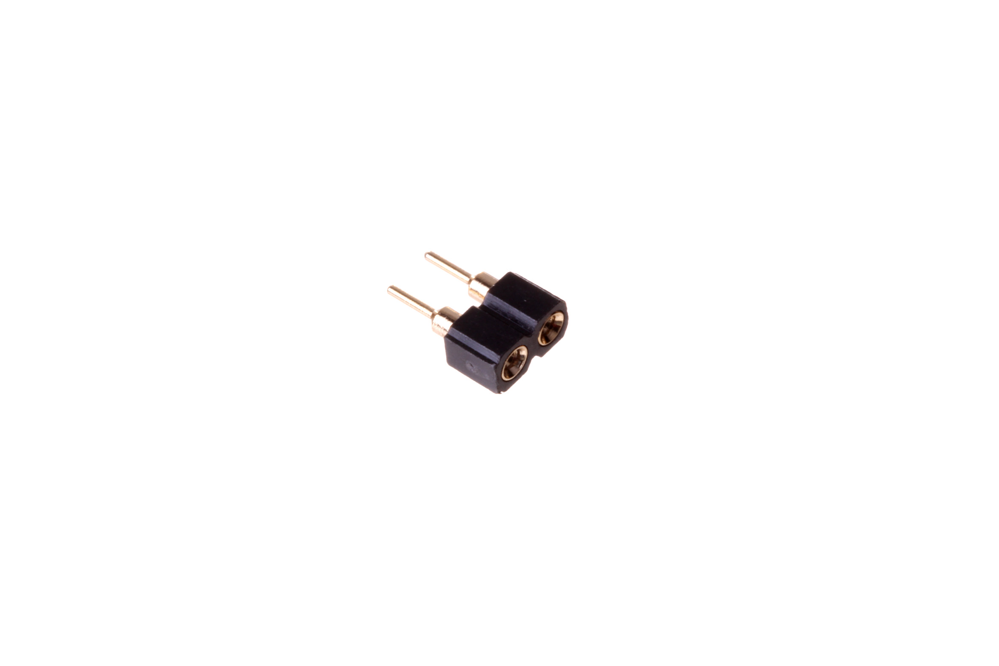
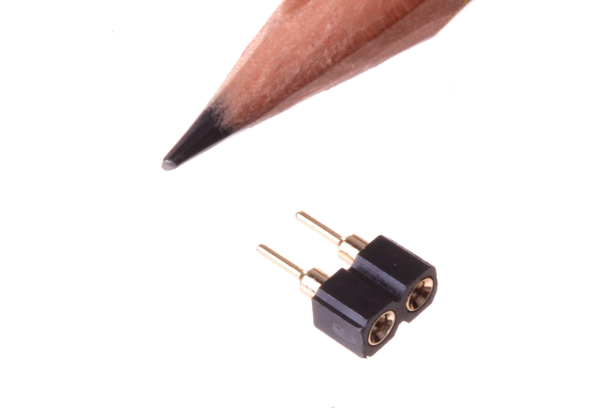

Contents
========

* [HEAF-I01-X-PI02-RO>2.54 mm 2 Pin Female Header (Round)](#heaf-i01-x-pi02-ro254-mm-2-pin-female-header-round)
	* [Images](#images)
	* [Datasheets](#datasheets)
	* [EDA](#eda)
		* [Footprints](#footprints)
		* [Symbols](#symbols)
	* [Tags](#tags)
  
![][im]
# HEAF-I01-X-PI02-RO>2.54 mm 2 Pin Female Header (Round)

- ID: HEAF-I01-X-PI02-RO
- Name: HEAF-I01-X-PI02-RO

## Images
  
  

|Main|Reference|
| :---: | :---: |
|||

## Datasheets

- Datasheet: [datasheet.pdf](datasheet.pdf)

## EDA

### Footprints
  

|||||
| :---: | :---: | :---: | :---: |

### Symbols

## Tags

- index: 237
- oompID: HEAF-I01-X-PI02-RO
- name: 2.54 mm 2 Pin Female Header (Round)
- hexID: HF2R
- oompSort: HEAFI0102PI
- oompType: HEAF
- oompSize: I01
- oompColor: X
- oompDesc: PI02
- oompIndex: RO
- oompVersion: 98
- ooDesignator: J1

[im]: image_600.jpg
