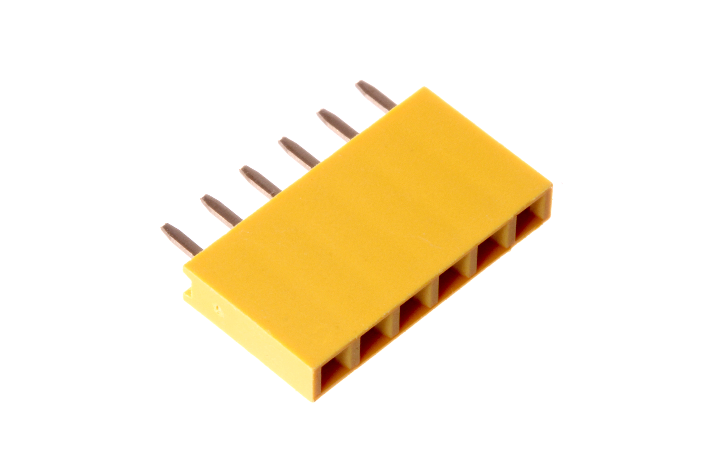
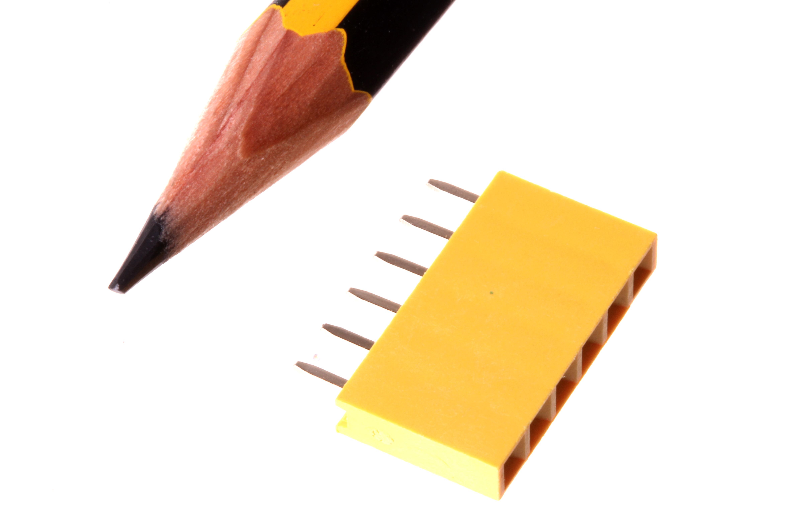

Contents
========

* [HEAF-I01-Y-PI06-01>2.54 mm 6 Pin Yellow Female Header](#heaf-i01-y-pi06-01254-mm-6-pin-yellow-female-header)
	* [Images](#images)
	* [Datasheets](#datasheets)
	* [EDA](#eda)
		* [Symbols](#symbols)
	* [Tags](#tags)
  
![][im]
# HEAF-I01-Y-PI06-01>2.54 mm 6 Pin Yellow Female Header

- ID: HEAF-I01-Y-PI06-01
- Name: HEAF-I01-Y-PI06-01

## Images
  
  

|Main|Reference|
| :---: | :---: |
|||

## Datasheets

- Datasheet: [datasheet.pdf](datasheet.pdf)

## EDA

### Symbols

## Tags

- index: 243
- oompID: HEAF-I01-Y-PI06-01
- name: 2.54 mm 6 Pin Yellow Female Header
- hexID: HF06Y
- oompSort: HEAFI0106PI
- oompType: HEAF
- oompSize: I01
- oompColor: Y
- oompDesc: PI06
- oompIndex: 01
- oompVersion: 98
- ooNumPins: 6
- ooFootprint: OOMP-HEAD-I01-X-PI06-01
- oompBbls: variable;clear
- oompBbls: variable;pins;6
- oompBbls: template;XXXX-I01-X-XX-01-bbls
- oompDiag: variable;clear
- oompDiag: variable;pins;6
- oompDiag: template;HEAF-I01-X-XX-01-diag
- drawItem: variable;clear
- drawItem: variable;pins;6
- drawItem: template;XXXX-I01-X-XX-01-iden
- oompSchem: variable;clear
- oompSchem: variable;pins;6
- oompSchem: template;XXXX-XX-X-XX-01-PINS-EVEN-schem
- oompSimp: variable;clear
- oompSimp: variable;pins;6
- oompSimp: template;XXXX-I01-X-XX-01-simp
- ooDesignator: J1

[im]: image_600.jpg
