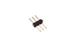
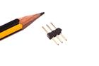
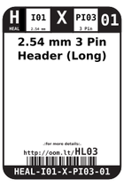
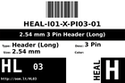
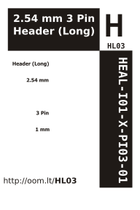

Contents
========

* [HL03 > 2.54 mm 3 Pin Header (Long)](#hl03--254-mm-3-pin-header-long)
	* [Images](#images)
	* [Datasheets](#datasheets)
	* [Labels](#labels)
	* [EDA](#eda)
	* [Tags](#tags)
  
![][im]
# HL03 > 2.54 mm 3 Pin Header (Long)

- ID: HEAL-I01-X-PI03-01
- Hex ID: HL03
- Name: 2.54 mm 3 Pin Header (Long)
- Description: 2.54 mm 3 Pin Header (Long)

## Images
  
  

|image|image_RE|label-front|label-inventory|label-spec|
| :---: | :---: | :---: | :---: | :---: |
||||||

## Datasheets

- Datasheet: [datasheet.pdf](datasheet.pdf)

## Labels
  
  

|label-front|label-inventory|label-spec|
| :---: | :---: | :---: |
||||

## EDA

### Symbols

## Tags

- oompID: HEAL-I01-X-PI03-01
- name: 2.54 mm 3 Pin Header (Long)
- hexID: HL03
- oompSort: 010103
- oompType: HEAL
- oompSize: I01
- oompColor: X
- oompDesc: PI03
- oompIndex: 01
- oompVersion: 99
- ooNumPins: 3
- ooFootprint: OOMP-HEAD-I01-X-PI03-01
- oompClass: Through Hole Component
- oompClassCode: THTH
- oompBbls: variable;clear
- oompBbls: variable;pins;3
- oompBbls: template;XXXX-I01-X-XX-01-bbls
- oompDiag: variable;clear
- oompDiag: variable;pins;3
- oompDiag: template;HEAL-I01-X-XX-01-diag
- drawItem: variable;clear
- drawItem: variable;pins;3
- drawItem: template;XXXX-I01-X-XX-01-iden
- oompSchem: variable;clear
- oompSchem: variable;pins;3
- oompSchem: template;XXXX-XX-X-XX-01-PINS-EVEN-schem
- oompSimp: variable;clear
- oompSimp: variable;pins;3
- oompSimp: template;XXXX-I01-X-XX-01-simp
- ooDesignator: J1

[im]: image_450.jpg
