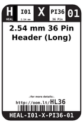
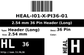

Contents
========

* [HL36 > 2.54 mm 36 Pin Header (Long)](#hl36--254-mm-36-pin-header-long)
	* [Datasheets](#datasheets)
	* [Labels](#labels)
	* [EDA](#eda)
	* [Images](#images)
	* [Tags](#tags)
  
![][im]
# HL36 > 2.54 mm 36 Pin Header (Long)

- ID: HEAL-I01-X-PI36-01
- Hex ID: HL36
- Name: 2.54 mm 36 Pin Header (Long)
- Description: 2.54 mm 36 Pin Header (Long)
- Long Link: [http://oom.lt/HEAL-I01-X-PI36-01](http://oom.lt/HEAL-I01-X-PI36-01)
- Long Link: [http://oom.lt/HL36](http://oom.lt/HL36)

## Datasheets

- Datasheet: [datasheet.pdf](datasheet.pdf)

## Labels
  
  

|label-front|label-inventory|label-spec|
| :---: | :---: | :---: |
||||

## EDA

### Symbols

## Images
  
  

|image|image_RE|label-front|label-inventory|label-spec|
| :---: | :---: | :---: | :---: | :---: |
||||||

## Tags

- oompID: HEAL-I01-X-PI36-01
- name: 2.54 mm 36 Pin Header (Long)
- hexID: HL36
- oompSort: 010136
- oompType: HEAL
- oompSize: I01
- oompColor: X
- oompDesc: PI36
- oompIndex: 01
- oompVersion: 10
- ooPitch: 2.54 mm
- ooWidth: 91.44 mm
- ooHeight: 14.54mm
- ooDepth: 2.54mm
- ooNumPins: 36
- ooFootprint: OOMP-HEAD-I01-X-PI36-01
- ooMaxCurrent: 3A
- ooMaxVoltage: 1000V
- oompAbout: These 36 pin strips are by far the most common length. They are designed to be snapped to any length (using either pliers or snips) so are the most useful to have in your toolbox.
- oompClass: Through Hole Component
- oompClassCode: THTH
- oompBbls: variable;clear
- oompBbls: variable;pins;36
- oompBbls: template;XXXX-I01-X-XX-01-bbls
- oompDiag: variable;clear
- oompDiag: variable;pins;36
- oompDiag: template;HEAL-I01-X-XX-01-diag
- drawItem: variable;clear
- drawItem: variable;pins;36
- drawItem: template;XXXX-I01-X-XX-01-iden
- oompSchem: variable;clear
- oompSchem: variable;pins;36
- oompSchem: template;XXXX-XX-X-XX-01-PINS-EVEN-schem
- oompSimp: variable;clear
- oompSimp: variable;pins;36
- oompSimp: template;XXXX-I01-X-XX-01-simp
- ooDesignator: J1

[im]: image_450.jpg
