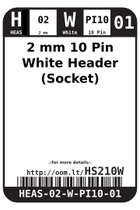
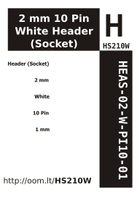

Contents
========

* [HS210W > 2 mm 10 Pin White Header (Socket)](#hs210w--2-mm-10-pin-white-header-socket)
	* [Images](#images)
	* [Datasheets](#datasheets)
	* [Labels](#labels)
	* [EDA](#eda)
	* [Tags](#tags)

# HS210W > 2 mm 10 Pin White Header (Socket)

- ID: HEAS-02-W-PI10-01
- Hex ID: HS210W
- Name: 2 mm 10 Pin White Header (Socket)
- Description: 2 mm 10 Pin White Header (Socket)

## Images
  
  

|label-front|label-inventory|label-spec|
| :---: | :---: | :---: |
||||

## Datasheets

- Datasheet: [datasheet.pdf](datasheet.pdf)

## Labels
  
  

|label-front|label-inventory|label-spec|
| :---: | :---: | :---: |
||||

## EDA

### Symbols

## Tags

- oompID: HEAS-02-W-PI10-01
- hexID: HS210W
- oompSort: 
- oompClass: Through Hole
- oompClassCode: THTH
- oompType: HEAS
- oompSize: 02
- oompColor: W
- oompDesc: PI10
- oompIndex: 01
- oompVersion: 40
- ooNumPins: 10
- ooFootprint: OOMP-HEAD-02-X-PI10-01
- ooDesignator: J1
