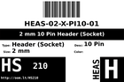
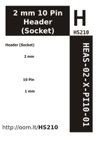

Contents
========

* [HS210 > 2 mm 10 Pin Header (Socket)](#hs210--2-mm-10-pin-header-socket)
	* [Datasheets](#datasheets)
	* [Labels](#labels)
	* [EDA](#eda)
	* [Images](#images)
	* [Tags](#tags)

# HS210 > 2 mm 10 Pin Header (Socket)

- ID: HEAS-02-X-PI10-01
- Hex ID: HS210
- Name: 2 mm 10 Pin Header (Socket)
- Description: 2 mm 10 Pin Header (Socket)
- Long Link: [http://oom.lt/HEAS-02-X-PI10-01](http://oom.lt/HEAS-02-X-PI10-01)
- Short Link: [http://oom.lt/HS210](http://oom.lt/HS210)

## Datasheets

- Datasheet: [datasheet.pdf](datasheet.pdf)

## Labels
  
  

|label-front|label-inventory|label-spec|
| :---: | :---: | :---: |
||||

## EDA

### Symbols

## Images
  
  

|label-front|label-inventory|label-spec|
| :---: | :---: | :---: |
||||

## Tags

- oompID: HEAS-02-X-PI10-01
- hexID: HS210
- oompSort: HEAS0210PI
- oompType: HEAS
- oompSize: 02
- oompColor: X
- oompDesc: PI10
- oompIndex: 01
- oompVersion: 98
- ooNumPins: 10
- ooFootprint: OOMP-HEAD-I01-X-PI10-01
- ooDesignator: J1
