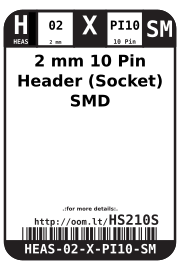
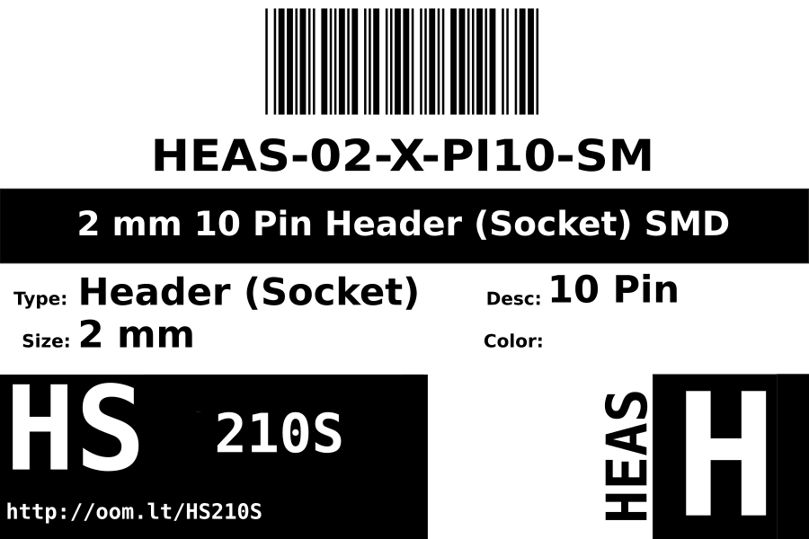

Contents
========

* [HEAS-02-X-PI10-SM>2 mm 10 Pin Header (Socket) SMD](#heas-02-x-pi10-sm2-mm-10-pin-header-socket-smd)
	* [Datasheets](#datasheets)
	* [Labels](#labels)
	* [EDA](#eda)
		* [Symbols](#symbols)
	* [Tags](#tags)

# HEAS-02-X-PI10-SM>2 mm 10 Pin Header (Socket) SMD

- ID: HEAS-02-X-PI10-SM
- Name: HEAS-02-X-PI10-SM

## Datasheets

- Datasheet: [datasheet.pdf](datasheet.pdf)

## Labels
  
  

|label-front|label-inventory|label-spec|
| :---: | :---: | :---: |
||||

## EDA

### Symbols

## Tags

- oompID: HEAS-02-X-PI10-SM
- hexID: HS210S
- oompSort: HEAS0210PI
- oompType: HEAS
- oompSize: 02
- oompColor: X
- oompDesc: PI10
- oompIndex: SM
- oompVersion: 98
- ooNumPins: 10
- ooFootprint: OOMP-HEAD-I01-X-PI10-SM
- ooDesignator: J1
