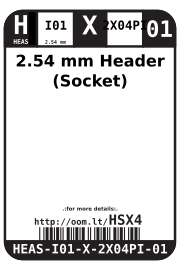
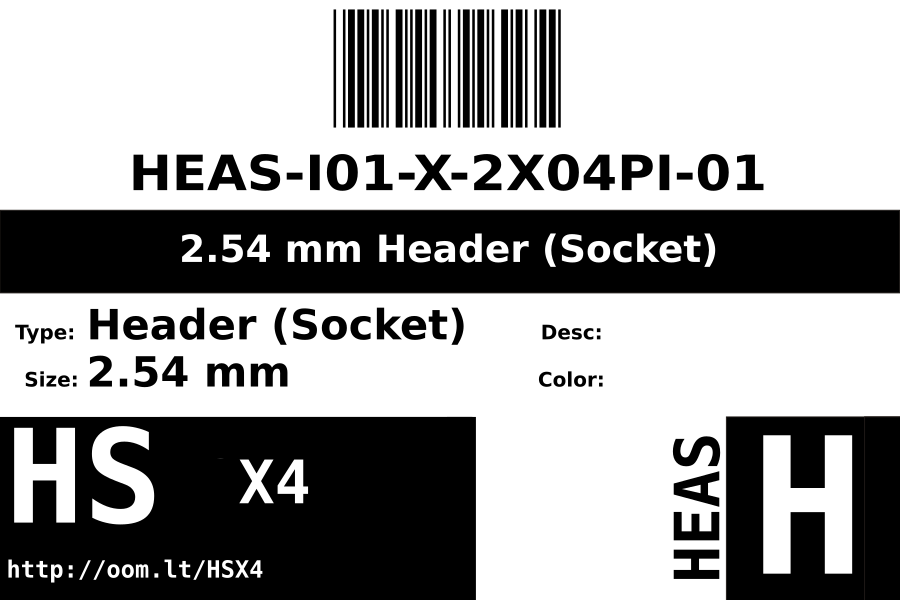

Contents
========

* [HEAS-I01-X-2X04PI-01>2.54 mm Header (Socket)](#heas-i01-x-2x04pi-01254-mm-header-socket)
	* [Images](#images)
	* [Datasheets](#datasheets)
	* [Labels](#labels)
	* [EDA](#eda)
		* [Symbols](#symbols)
	* [Tags](#tags)
  
![][im]
# HEAS-I01-X-2X04PI-01>2.54 mm Header (Socket)

- ID: HEAS-I01-X-2X04PI-01
- Name: HEAS-I01-X-2X04PI-01

## Images
  
  

|image|image_RE|
| :---: | :---: |
|||

## Datasheets

- Datasheet: [datasheet.pdf](datasheet.pdf)

## Labels
  
  

|label-front|label-inventory|label-spec|
| :---: | :---: | :---: |
||||

## EDA

### Symbols

## Tags

- oompID: HEAS-I01-X-2X04PI-01
- hexID: HSX4
- oompSort: HEAS012X04PI
- oompType: HEAS
- oompSize: I01
- oompColor: X
- oompDesc: 2X04PI
- oompIndex: 01
- oompVersion: 98
- ooNumPins: 2X04
- ooFootprint: OOMP-HEAD-I01-X-2X04PI-01
- ooDesignator: J1

[im]: image_600.jpg
