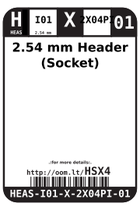
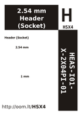
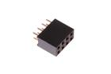
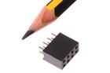

Contents
========

* [HSX4 > 2.54 mm Header (Socket)](#hsx4--254-mm-header-socket)
	* [Datasheets](#datasheets)
	* [Labels](#labels)
	* [EDA](#eda)
	* [Images](#images)
	* [Tags](#tags)
  
![][im]
# HSX4 > 2.54 mm Header (Socket)

- ID: HEAS-I01-X-2X04PI-01
- Hex ID: HSX4
- Name: 2.54 mm Header (Socket)
- Description: 2.54 mm Header (Socket)
- Long Link: [http://oom.lt/HEAS-I01-X-2X04PI-01](http://oom.lt/HEAS-I01-X-2X04PI-01)
- Short Link: [http://oom.lt/HSX4](http://oom.lt/HSX4)

## Datasheets

- Datasheet: [datasheet.pdf](datasheet.pdf)

## Labels
  
  

|label-front|label-inventory|label-spec|
| :---: | :---: | :---: |
||||

## EDA

## Images
  
  

|image|image_RE|label-front|label-inventory|label-spec|
| :---: | :---: | :---: | :---: | :---: |
||||||

## Tags

- oompID: HEAS-I01-X-2X04PI-01
- hexID: HSX4
- oompSort: HEAS012X04PI
- oompType: HEAS
- oompSize: I01
- oompColor: X
- oompDesc: 2X04PI
- oompIndex: 01
- oompVersion: 98
- ooNumPins: 2X04
- ooFootprint: OOMP-HEAD-I01-X-2X04PI-01
- ooDesignator: J1

[im]: image_450.jpg
