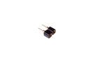

Contents
========

* [HS2R > 2.54 mm 2 Pin Header (Socket) (Round)](#hs2r--254-mm-2-pin-header-socket-round)
	* [Datasheets](#datasheets)
	* [Labels](#labels)
	* [EDA](#eda)
	* [Images](#images)
	* [Tags](#tags)
  
![][im]
# HS2R > 2.54 mm 2 Pin Header (Socket) (Round)

- ID: HEAS-I01-X-PI02-RO
- Hex ID: HS2R
- Name: 2.54 mm 2 Pin Header (Socket) (Round)
- Description: 2.54 mm 2 Pin Header (Socket) (Round)
- Long Link: [http://oom.lt/HEAS-I01-X-PI02-RO](http://oom.lt/HEAS-I01-X-PI02-RO)
- Long Link: [http://oom.lt/HS2R](http://oom.lt/HS2R)

## Datasheets

- Datasheet: [datasheet.pdf](datasheet.pdf)

## Labels
  
  

|label-front|label-inventory|label-spec|
| :---: | :---: | :---: |
||||

## EDA

### Symbols

## Images
  
  

|image|image_RE|label-front|label-inventory|label-spec|
| :---: | :---: | :---: | :---: | :---: |
||||||

## Tags

- oompID: HEAS-I01-X-PI02-RO
- hexID: HS2R
- oompSort: HEASI0102PI
- oompType: HEAS
- oompSize: I01
- oompColor: X
- oompDesc: PI02
- oompIndex: RO
- oompVersion: 98
- ooDesignator: J1

[im]: image_450.jpg
