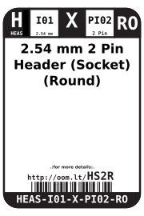

Contents
========

* [HEAS-I01-X-PI02-RO>2.54 mm 2 Pin Header (Socket) (Round)](#heas-i01-x-pi02-ro254-mm-2-pin-header-socket-round)
	* [Images](#images)
	* [Datasheets](#datasheets)
	* [Labels](#labels)
	* [EDA](#eda)
		* [Symbols](#symbols)
	* [Tags](#tags)
  
![][im]
# HEAS-I01-X-PI02-RO>2.54 mm 2 Pin Header (Socket) (Round)

- ID: HEAS-I01-X-PI02-RO
- Name: HEAS-I01-X-PI02-RO

## Images
  
  

|image|image_RE|
| :---: | :---: |
|||

## Datasheets

- Datasheet: [datasheet.pdf](datasheet.pdf)

## Labels
  
  

|label-front|label-inventory|label-spec|
| :---: | :---: | :---: |
||||

## EDA

### Symbols

## Tags

- oompID: HEAS-I01-X-PI02-RO
- hexID: HS2R
- oompSort: HEASI0102PI
- oompType: HEAS
- oompSize: I01
- oompColor: X
- oompDesc: PI02
- oompIndex: RO
- oompVersion: 98
- ooDesignator: J1

[im]: image_600.jpg
