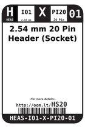
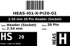
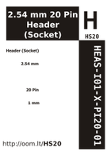

Contents
========

* [HS20 > 2.54 mm 20 Pin Header (Socket)](#hs20--254-mm-20-pin-header-socket)
	* [Datasheets](#datasheets)
	* [Labels](#labels)
	* [EDA](#eda)
	* [Images](#images)
	* [Tags](#tags)

# HS20 > 2.54 mm 20 Pin Header (Socket)

- ID: HEAS-I01-X-PI20-01
- Hex ID: HS20
- Name: 2.54 mm 20 Pin Header (Socket)
- Description: 2.54 mm 20 Pin Header (Socket)
- Long Link: [http://oom.lt/HEAS-I01-X-PI20-01](http://oom.lt/HEAS-I01-X-PI20-01)
- Short Link: [http://oom.lt/HS20](http://oom.lt/HS20)

## Datasheets

- Datasheet: [datasheet.pdf](datasheet.pdf)

## Labels
  
  

|label-front|label-inventory|label-spec|
| :---: | :---: | :---: |
||||

## EDA

### Symbols

## Images
  
  

|label-front|label-inventory|label-spec|
| :---: | :---: | :---: |
||||

## Tags

- oompID: HEAS-I01-X-PI20-01
- hexID: HS20
- oompSort: A010120
- oompType: HEAS
- oompSize: I01
- oompColor: X
- oompDesc: PI20
- oompIndex: 01
- oompVersion: 99
- oompSkip: true
- ooPitch: 2.54 mm
- ooWidth: 50.8 mm
- ooHeight: 11.65mm
- ooLength: 2.54 mm
- ooFootprint: OOMP-HEAD-I01-X-PI20-01
- ooNumPins: 20
- oompAbout: A commonly used 20 pin 2.54 mm spaced female header. Nice to use for a connector to another PCB (via a header like <a href="http://learn.oomlout.co.uk/OO/Projects/oomp/part/HEAD-I01-X-PI10-01">2.54 mm 10 Pin Header</a>) or to connect jumper wires to your project.
- oompClass: Through Hole Component
- oompClassCode: THTH
- oompBbls: variable;clear
- oompBbls: variable;pins;20
- oompBbls: template;XXXX-I01-X-XX-01-bbls
- oompDiag: variable;clear
- oompDiag: variable;pins;20
- oompDiag: template;HEAS-I01-X-XX-01-diag
- drawItem: variable;clear
- drawItem: variable;pins;20
- drawItem: template;XXXX-I01-X-XX-01-iden
- oompSchem: variable;clear
- oompSchem: variable;pins;20
- oompSchem: template;XXXX-XX-X-XX-01-PINS-EVEN-schem
- oompSimp: variable;clear
- oompSimp: variable;pins;20
- oompSimp: template;XXXX-I01-X-XX-01-simp
- ooDesignator: J1
