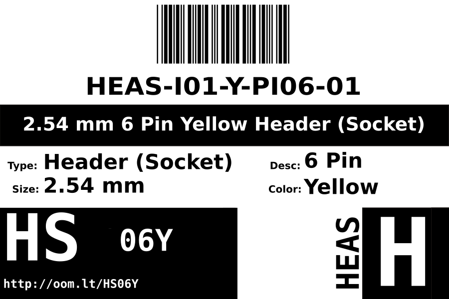

Contents
========

* [HEAS-I01-Y-PI06-01>2.54 mm 6 Pin Yellow Header (Socket)](#heas-i01-y-pi06-01254-mm-6-pin-yellow-header-socket)
	* [Images](#images)
	* [Datasheets](#datasheets)
	* [Labels](#labels)
	* [EDA](#eda)
		* [Symbols](#symbols)
	* [Tags](#tags)
  
![][im]
# HEAS-I01-Y-PI06-01>2.54 mm 6 Pin Yellow Header (Socket)

- ID: HEAS-I01-Y-PI06-01
- Name: HEAS-I01-Y-PI06-01

## Images
  
  

|image|image_RE|
| :---: | :---: |
|||

## Datasheets

- Datasheet: [datasheet.pdf](datasheet.pdf)

## Labels
  
  

|label-front|label-inventory|label-spec|
| :---: | :---: | :---: |
||||

## EDA

### Symbols

## Tags

- oompID: HEAS-I01-Y-PI06-01
- hexID: HS06Y
- oompSort: HEASI0106PI
- oompType: HEAS
- oompSize: I01
- oompColor: Y
- oompDesc: PI06
- oompIndex: 01
- oompVersion: 98
- ooNumPins: 6
- ooFootprint: OOMP-HEAD-I01-X-PI06-01
- oompBbls: variable;clear
- oompBbls: variable;pins;6
- oompBbls: template;XXXX-I01-X-XX-01-bbls
- oompDiag: variable;clear
- oompDiag: variable;pins;6
- oompDiag: template;HEAS-I01-X-XX-01-diag
- drawItem: variable;clear
- drawItem: variable;pins;6
- drawItem: template;XXXX-I01-X-XX-01-iden
- oompSchem: variable;clear
- oompSchem: variable;pins;6
- oompSchem: template;XXXX-XX-X-XX-01-PINS-EVEN-schem
- oompSimp: variable;clear
- oompSimp: variable;pins;6
- oompSimp: template;XXXX-I01-X-XX-01-simp
- ooDesignator: J1

[im]: image_600.jpg
