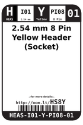
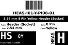
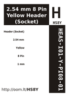
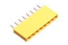

Contents
========

* [HS8Y > 2.54 mm 8 Pin Yellow Header (Socket)](#hs8y--254-mm-8-pin-yellow-header-socket)
	* [Datasheets](#datasheets)
	* [Labels](#labels)
	* [EDA](#eda)
	* [Images](#images)
	* [Tags](#tags)
  
![][im]
# HS8Y > 2.54 mm 8 Pin Yellow Header (Socket)

- ID: HEAS-I01-Y-PI08-01
- Hex ID: HS8Y
- Name: 2.54 mm 8 Pin Yellow Header (Socket)
- Description: 2.54 mm 8 Pin Yellow Header (Socket)
- Long Link: [http://oom.lt/HEAS-I01-Y-PI08-01](http://oom.lt/HEAS-I01-Y-PI08-01)
- Long Link: [http://oom.lt/HS8Y](http://oom.lt/HS8Y)

## Datasheets

- Datasheet: [datasheet.pdf](datasheet.pdf)

## Labels
  
  

|label-front|label-inventory|label-spec|
| :---: | :---: | :---: |
||||

## EDA

### Symbols

## Images
  
  

|image|label-front|label-inventory|label-spec|
| :---: | :---: | :---: | :---: |
|||||

## Tags

- oompID: HEAS-I01-Y-PI08-01
- hexID: HS8Y
- oompSort: 010803
- oompType: HEAS
- oompSize: I01
- oompColor: Y
- oompDesc: PI08
- oompIndex: 01
- oompVersion: 99
- ooManufacturer: C-YXCO
- ooManufacturerPartNumber: F185-1108A1BSYC1
- ooNumPins: 8
- ooFootprint: OOMP-HEAD-I01-X-PI08-01
- ooSEEEDsku: 3460590P1
- ooSEEEDdesc: DIP Yellow Female Header
- ooSEEED3dModel: http://www.seeedstudio.com/wiki/File:1X8P-2.54-8.5-YELLOW-FEMALE.zip
- oompBbls: variable;clear
- oompBbls: variable;pins;8
- oompBbls: template;XXXX-I01-X-XX-01-bbls
- oompDiag: variable;clear
- oompDiag: variable;pins;8
- oompDiag: template;HEAS-I01-X-XX-01-diag
- drawItem: variable;clear
- drawItem: variable;pins;8
- drawItem: template;XXXX-I01-X-XX-01-iden
- oompSchem: variable;clear
- oompSchem: variable;pins;8
- oompSchem: template;XXXX-XX-X-XX-01-PINS-EVEN-schem
- oompSimp: variable;clear
- oompSimp: variable;pins;8
- oompSimp: template;XXXX-I01-X-XX-01-simp
- ooDesignator: J1

[im]: image_450.jpg
