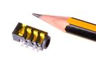
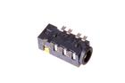
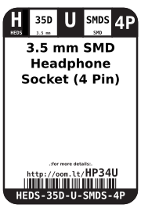
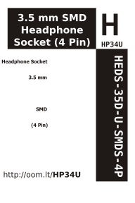

Contents
========

* [HEDS-35D-U-SMDS-4P>3.5 mm SMD Headphone Socket (4 Pin)](#heds-35d-u-smds-4p35-mm-smd-headphone-socket-4-pin)
	* [Images](#images)
	* [Datasheets](#datasheets)
	* [Labels](#labels)
	* [EDA](#eda)
		* [Symbols](#symbols)
	* [Tags](#tags)
  
![][im]
# HEDS-35D-U-SMDS-4P>3.5 mm SMD Headphone Socket (4 Pin)

- ID: HEDS-35D-U-SMDS-4P
- Name: HEDS-35D-U-SMDS-4P

## Images
  
  

|image|image_RE|image_BOTTOM|
| :---: | :---: | :---: |
||||

## Datasheets

- Datasheet: [datasheet.pdf](datasheet.pdf)

## Labels
  
  

|label-front|label-inventory|label-spec|
| :---: | :---: | :---: |
||||

## EDA

### Symbols

## Tags

- oompID: HEDS-35D-U-SMDS-4P
- name: 3.5 mm SMD Headphone Socket (4 Pin)
- hexID: HP34U
- oompSort: HEDS35DSMDS
- oompType: HEDS
- oompSize: 35D
- oompColor: U
- oompDesc: SMDS
- oompIndex: 4P
- oompVersion: 98
- ooDesignator: J1

[im]: image_600.jpg
