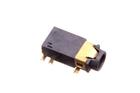
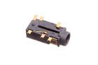
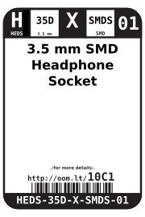

Contents
========

* [HEDS-35D-X-SMDS-01>3.5 mm SMD Headphone Socket](#heds-35d-x-smds-0135-mm-smd-headphone-socket)
	* [Images](#images)
	* [Datasheets](#datasheets)
	* [Labels](#labels)
	* [EDA](#eda)
		* [Symbols](#symbols)
	* [Tags](#tags)
  
![][im]
# HEDS-35D-X-SMDS-01>3.5 mm SMD Headphone Socket

- ID: HEDS-35D-X-SMDS-01
- Name: HEDS-35D-X-SMDS-01

## Images
  
  

|image|image_BOTTOM|
| :---: | :---: |
|||

## Datasheets

- Datasheet: [datasheet.pdf](datasheet.pdf)

## Labels
  
  

|label-front|label-inventory|label-spec|
| :---: | :---: | :---: |
||||

## EDA

### Symbols

## Tags

- oompID: HEDS-35D-X-SMDS-01
- name: 3.5 mm SMD Headphone Socket
- hexID: 10C1
- oompSort: 
- oompType: HEDS
- oompSize: 35D
- oompColor: X
- oompDesc: SMDS
- oompIndex: 01
- oompVersion: 99
- ooManufacturer: C-SUNT
- ooManufacturerPartNumber: ST-PJ-312
- ooSEEEDsku: 3440030P1
- ooSEEEDdesc: AUDIO-Connector
- ooSEEED3dModel: http://www.seeedstudio.com/wiki/File:6P-SMD-3.5.zip
- ooDesignator: J1

[im]: image_600.jpg
