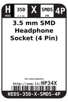
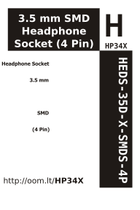

Contents
========

* [HP34X > 3.5 mm SMD Headphone Socket (4 Pin)](#hp34x--35-mm-smd-headphone-socket-4-pin)
	* [Images](#images)
	* [Datasheets](#datasheets)
	* [Labels](#labels)
	* [EDA](#eda)
	* [Tags](#tags)

# HP34X > 3.5 mm SMD Headphone Socket (4 Pin)

- ID: HEDS-35D-X-SMDS-4P
- Hex ID: HP34X
- Name: 3.5 mm SMD Headphone Socket (4 Pin)
- Description: 3.5 mm SMD Headphone Socket (4 Pin)

## Images
  
  

|label-front|label-inventory|label-spec|
| :---: | :---: | :---: |
||||

## Datasheets

- Datasheet: [datasheet.pdf](datasheet.pdf)

## Labels
  
  

|label-front|label-inventory|label-spec|
| :---: | :---: | :---: |
||||

## EDA

### Symbols

## Tags

- oompID: HEDS-35D-X-SMDS-4P
- name: 3.5 mm SMD Headphone Socket (4 Pin)
- hexID: HP34X
- oompSort: HEDS35DSMDS
- oompType: HEDS
- oompSize: 35D
- oompColor: X
- oompDesc: SMDS
- oompIndex: 4P
- oompVersion: 98
- ooDesignator: J1
