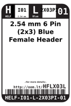
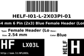

Contents
========

* [HFLX03L > 2.54 mm 6 Pin (2x3) Blue Female Header (Long)](#hflx03l--254-mm-6-pin-2x3-blue-female-header-long)
	* [Images](#images)
	* [Datasheets](#datasheets)
	* [Labels](#labels)
	* [EDA](#eda)
	* [Tags](#tags)
  
![][im]
# HFLX03L > 2.54 mm 6 Pin (2x3) Blue Female Header (Long)

- ID: HELF-I01-L-2X03PI-01
- Hex ID: HFLX03L
- Name: 2.54 mm 6 Pin (2x3) Blue Female Header (Long)
- Description: 2.54 mm 6 Pin (2x3) Blue Female Header (Long)

## Images
  
  

|image|label-front|label-inventory|label-spec|
| :---: | :---: | :---: | :---: |
|||||

## Datasheets

- Datasheet: [datasheet.pdf](datasheet.pdf)

## Labels
  
  

|label-front|label-inventory|label-spec|
| :---: | :---: | :---: |
||||

## EDA

### Symbols

## Tags

- oompID: HELF-I01-L-2X03PI-01
- name: 2.54 mm 6 Pin (2x3) Blue Female Header (Long)
- hexID: HFLX03L
- oompSort: 
- oompClass: Through Hole
- oompClassCode: THTH
- oompType: HELF
- oompSize: I01
- oompColor: L
- oompDesc: 2X03PI
- oompIndex: 01
- oompVersion: 40
- ooDesignator: J1

[im]: image_450.jpg
