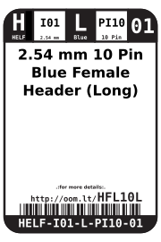

Contents
========

* [HELF-I01-L-PI10-01>2.54 mm 10 Pin Blue Female Header (Long)](#helf-i01-l-pi10-01254-mm-10-pin-blue-female-header-long)
	* [Images](#images)
	* [Datasheets](#datasheets)
	* [Labels](#labels)
	* [EDA](#eda)
		* [Symbols](#symbols)
	* [Tags](#tags)
  
![][im]
# HELF-I01-L-PI10-01>2.54 mm 10 Pin Blue Female Header (Long)

- ID: HELF-I01-L-PI10-01
- Name: HELF-I01-L-PI10-01

## Images
  
  

|image|
| :---: |
||

## Datasheets

- Datasheet: [datasheet.pdf](datasheet.pdf)

## Labels
  
  

|label-front|label-inventory|label-spec|
| :---: | :---: | :---: |
||||

## EDA

### Symbols

## Tags

- oompID: HELF-I01-L-PI10-01
- name: 2.54 mm 10 Pin Blue Female Header (Long)
- hexID: HFL10L
- oompSort: 
- oompClass: Through Hole
- oompClassCode: THTH
- oompType: HELF
- oompSize: I01
- oompColor: L
- oompDesc: PI10
- oompIndex: 01
- oompVersion: 40
- ooDesignator: J1

[im]: image_600.jpg
