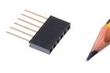
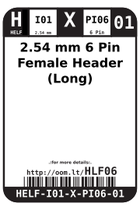
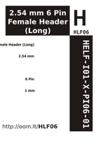

Contents
========

* [HLF06 > 2.54 mm 6 Pin Female Header (Long)](#hlf06--254-mm-6-pin-female-header-long)
	* [Images](#images)
	* [Datasheets](#datasheets)
	* [Labels](#labels)
	* [EDA](#eda)
	* [Tags](#tags)
  
![][im]
# HLF06 > 2.54 mm 6 Pin Female Header (Long)

- ID: HELF-I01-X-PI06-01
- Hex ID: HLF06
- Name: 2.54 mm 6 Pin Female Header (Long)
- Description: 2.54 mm 6 Pin Female Header (Long)

## Images
  
  

|image|image_RE|label-front|label-inventory|label-spec|
| :---: | :---: | :---: | :---: | :---: |
||||||

## Datasheets

- Datasheet: [datasheet.pdf](datasheet.pdf)

## Labels
  
  

|label-front|label-inventory|label-spec|
| :---: | :---: | :---: |
||||

## EDA

### Symbols

## Tags

- oompID: HELF-I01-X-PI06-01
- name: 2.54 mm 6 Pin Female Header (Long)
- hexID: HLF06
- oompSort: HELFI0106PI
- oompType: HELF
- oompSize: I01
- oompColor: X
- oompDesc: PI06
- oompIndex: 01
- oompVersion: 98
- ooDesignator: J1

[im]: image_450.jpg
