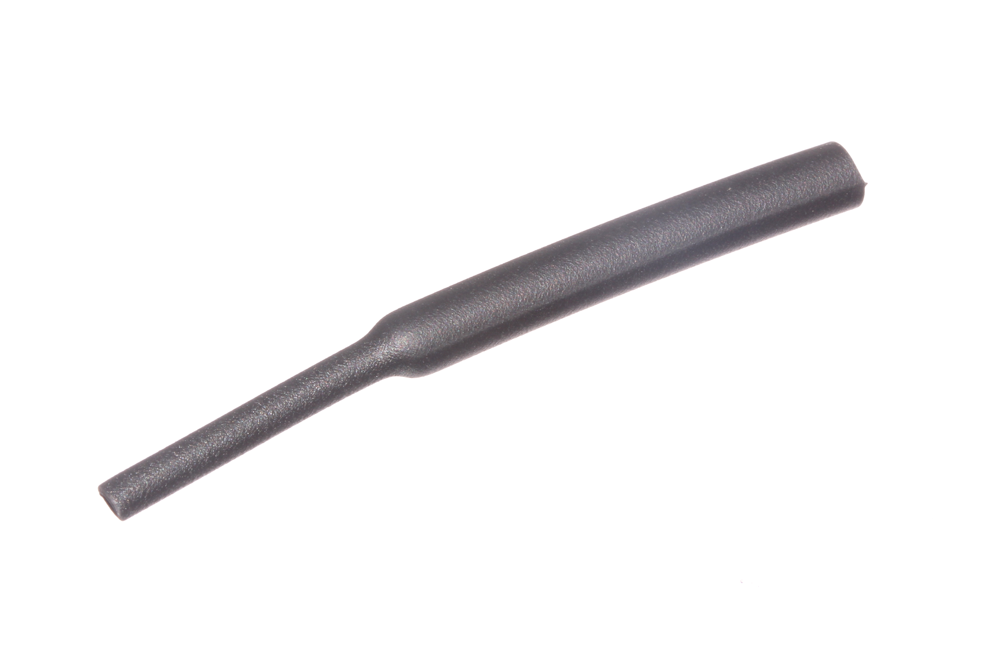
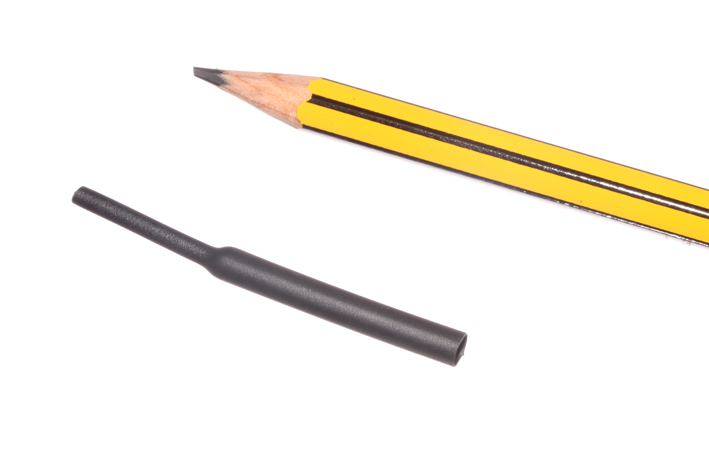
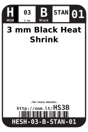
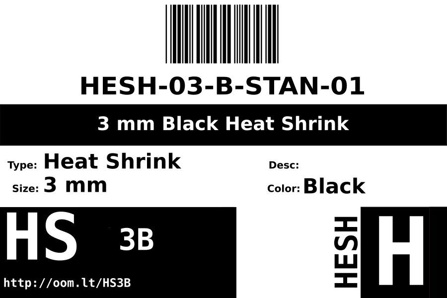

Contents
========

* [HESH-03-B-STAN-01>3 mm Black Heat Shrink](#hesh-03-b-stan-013-mm-black-heat-shrink)
	* [Images](#images)
	* [Datasheets](#datasheets)
	* [Labels](#labels)
	* [EDA](#eda)
		* [Symbols](#symbols)
	* [Tags](#tags)
  
![][im]
# HESH-03-B-STAN-01>3 mm Black Heat Shrink

- ID: HESH-03-B-STAN-01
- Name: HESH-03-B-STAN-01

## Images
  
  

|Main|Reference|
| :---: | :---: |
|||

## Datasheets

- Datasheet: [datasheet.pdf](datasheet.pdf)

## Labels
  
  

|Front|Inventory|Specifications|
| :---: | :---: | :---: |
||||

## EDA

### Symbols

## Tags

- index: 12557
- index: 4008
- oompID: HESH-03-B-STAN-01
- name: 3 mm Black Heat Shrink
- hexID: HS3B
- oompSort: 0303B
- oompType: HESH
- oompSize: 03
- oompColor: B
- oompDesc: STAN
- oompIndex: 01
- oompVersion: 27
- ooShrinkRatio: 2:1
- oompClass: Wiring
- oompClassCode: WIRE

[im]: image_600.jpg
