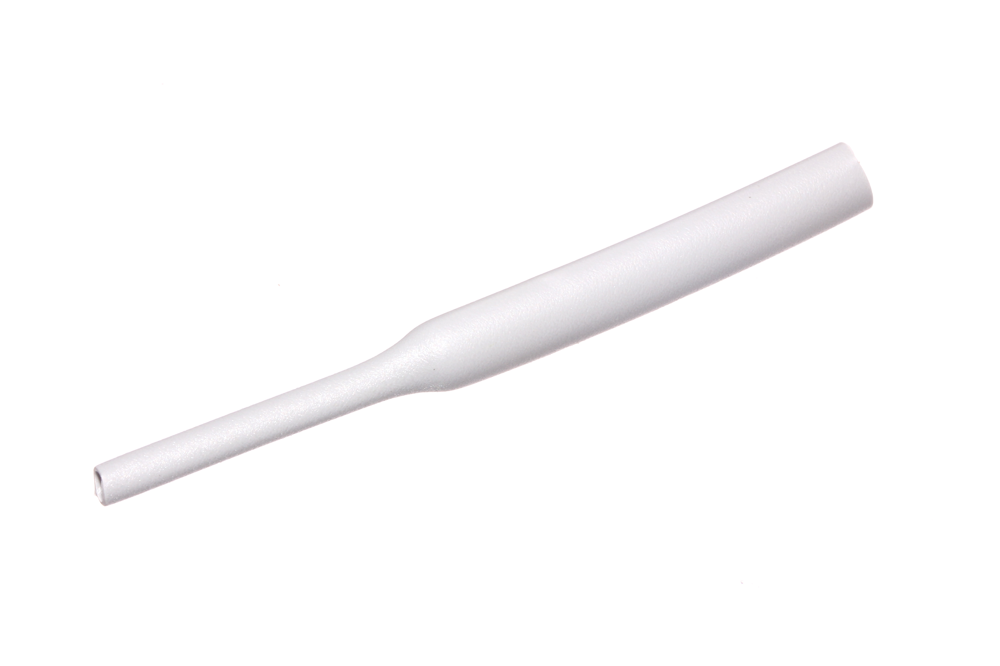

Contents
========

* [HESH-03-E-STAN-01>3 mm Grey Heat Shrink](#hesh-03-e-stan-013-mm-grey-heat-shrink)
	* [Images](#images)
	* [Datasheets](#datasheets)
	* [EDA](#eda)
		* [Footprints](#footprints)
		* [Symbols](#symbols)
	* [Tags](#tags)

# HESH-03-E-STAN-01>3 mm Grey Heat Shrink

- ID: HESH-03-E-STAN-01
- Name: HESH-03-E-STAN-01

## Images
  
  

|Main|
| :---: |
||

## Datasheets

- Datasheet: [datasheet.pdf](datasheet.pdf)

## EDA

### Footprints
  

|||||
| :---: | :---: | :---: | :---: |

### Symbols

## Tags

- index: 259
- index: 4007
- oompID: HESH-03-E-STAN-01
- name: 3 mm Grey Heat Shrink
- hexID: HS3E
- oompSort: 0303E
- oompType: HESH
- oompSize: 03
- oompColor: E
- oompDesc: STAN
- oompIndex: 01
- oompVersion: 27
- ooShrinkRatio: 2:1
- oompClass: Wiring
- oompClassCode: WIRE
