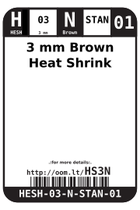
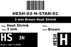
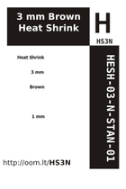

Contents
========

* [HS3N > 3 mm Brown Heat Shrink](#hs3n--3-mm-brown-heat-shrink)
	* [Datasheets](#datasheets)
	* [Labels](#labels)
	* [EDA](#eda)
	* [Images](#images)
	* [Tags](#tags)
  
![][im]
# HS3N > 3 mm Brown Heat Shrink

- ID: HESH-03-N-STAN-01
- Hex ID: HS3N
- Name: 3 mm Brown Heat Shrink
- Description: 3 mm Brown Heat Shrink
- Long Link: [http://oom.lt/HESH-03-N-STAN-01](http://oom.lt/HESH-03-N-STAN-01)
- Short Link: [http://oom.lt/HS3N](http://oom.lt/HS3N)

## Datasheets

- Datasheet: [datasheet.pdf](datasheet.pdf)

## Labels
  
  

|label-front|label-inventory|label-spec|
| :---: | :---: | :---: |
||||

## EDA

### Symbols

## Images
  
  

|image|label-front|label-inventory|label-spec|
| :---: | :---: | :---: | :---: |
|||||

## Tags

- oompID: HESH-03-N-STAN-01
- name: 3 mm Brown Heat Shrink
- hexID: HS3N
- oompSort: 0303N
- oompType: HESH
- oompSize: 03
- oompColor: N
- oompDesc: STAN
- oompIndex: 01
- oompVersion: 27
- ooShrinkRatio: 2:1
- oompClass: Wiring
- oompClassCode: WIRE

[im]: image_450.jpg
