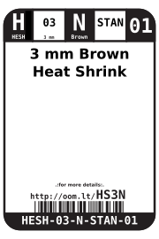
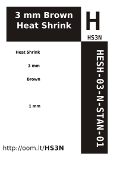

Contents
========

* [HESH-03-N-STAN-01>3 mm Brown Heat Shrink](#hesh-03-n-stan-013-mm-brown-heat-shrink)
	* [Images](#images)
	* [Datasheets](#datasheets)
	* [Labels](#labels)
	* [EDA](#eda)
		* [Symbols](#symbols)
	* [Tags](#tags)
  
![][im]
# HESH-03-N-STAN-01>3 mm Brown Heat Shrink

- ID: HESH-03-N-STAN-01
- Name: HESH-03-N-STAN-01

## Images
  
  

|Main|
| :---: |
||

## Datasheets

- Datasheet: [datasheet.pdf](datasheet.pdf)

## Labels
  
  

|Front|Inventory|Specifications|
| :---: | :---: | :---: |
||||

## EDA

### Symbols

## Tags

- index: 12561
- index: 4000
- oompID: HESH-03-N-STAN-01
- name: 3 mm Brown Heat Shrink
- hexID: HS3N
- oompSort: 0303N
- oompType: HESH
- oompSize: 03
- oompColor: N
- oompDesc: STAN
- oompIndex: 01
- oompVersion: 27
- ooShrinkRatio: 2:1
- oompClass: Wiring
- oompClassCode: WIRE

[im]: image_600.jpg
