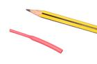
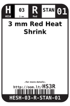
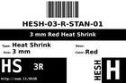
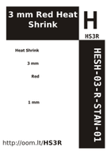

Contents
========

* [HS3R > 3 mm Red Heat Shrink](#hs3r--3-mm-red-heat-shrink)
	* [Images](#images)
	* [Datasheets](#datasheets)
	* [Labels](#labels)
	* [EDA](#eda)
	* [Tags](#tags)
  
![][im]
# HS3R > 3 mm Red Heat Shrink

- ID: HESH-03-R-STAN-01
- Hex ID: HS3R
- Name: 3 mm Red Heat Shrink
- Description: 3 mm Red Heat Shrink

## Images
  
  

|image|image_RE|label-front|label-inventory|label-spec|
| :---: | :---: | :---: | :---: | :---: |
||||||

## Datasheets

- Datasheet: [datasheet.pdf](datasheet.pdf)

## Labels
  
  

|label-front|label-inventory|label-spec|
| :---: | :---: | :---: |
||||

## EDA

### Symbols

## Tags

- oompID: HESH-03-R-STAN-01
- name: 3 mm Red Heat Shrink
- hexID: HS3R
- oompSort: 0303R
- oompType: HESH
- oompSize: 03
- oompColor: R
- oompDesc: STAN
- oompIndex: 01
- oompVersion: 27
- ooShrinkRatio: 2:1
- oompClass: Wiring
- oompClassCode: WIRE

[im]: image_450.jpg
