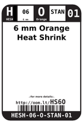
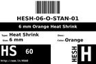
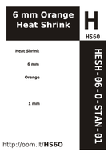
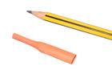

Contents
========

* [HS6O > 6 mm Orange Heat Shrink](#hs6o--6-mm-orange-heat-shrink)
	* [Datasheets](#datasheets)
	* [Labels](#labels)
	* [EDA](#eda)
	* [Images](#images)
	* [Tags](#tags)
  
![][im]
# HS6O > 6 mm Orange Heat Shrink

- ID: HESH-06-O-STAN-01
- Hex ID: HS6O
- Name: 6 mm Orange Heat Shrink
- Description: 6 mm Orange Heat Shrink
- Long Link: [http://oom.lt/HESH-06-O-STAN-01](http://oom.lt/HESH-06-O-STAN-01)
- Short Link: [http://oom.lt/HS6O](http://oom.lt/HS6O)

## Datasheets

- Datasheet: [datasheet.pdf](datasheet.pdf)

## Labels
  
  

|label-front|label-inventory|label-spec|
| :---: | :---: | :---: |
||||

## EDA

### Symbols

## Images
  
  

|image|image_RE|label-front|label-inventory|label-spec|
| :---: | :---: | :---: | :---: | :---: |
||||||

## Tags

- oompID: HESH-06-O-STAN-01
- name: 6 mm Orange Heat Shrink
- hexID: HS6O
- oompSort: 0606O
- oompType: HESH
- oompSize: 06
- oompColor: O
- oompDesc: STAN
- oompIndex: 01
- oompVersion: 27
- ooShrinkRatio: 2:1
- oompClass: Wiring
- oompClassCode: WIRE

[im]: image_450.jpg
